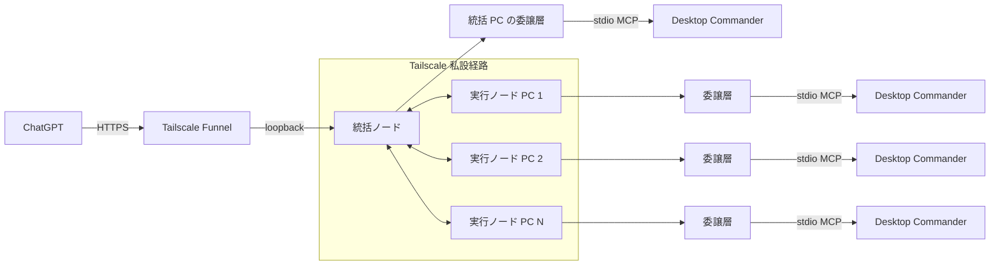
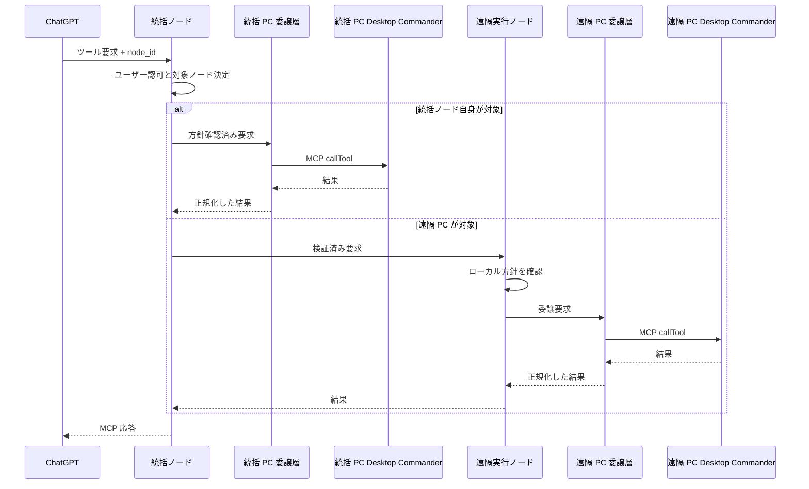

# 複数 PC 接続設計

## 目的

1つの ChatGPT 接続から、複数の PC 上で動作する RemoteDesktopMCP を操作できるようにする。

外部へ公開する MCP サーバーは1つに集約し、そのサーバーが要求の対象 PC を選択して各 PC へ処理を振り分ける。

## 役割

各 PC では同じ RemoteDesktopMCP を動作させ、設定によって次の役割を持たせる。

- 統括ノード: ChatGPT からの MCP 接続、ユーザー認証、RemoteDesktopMCP セッション管理、対象ノード選択、要求振り分けを担当する。
- 実行ノード: ローカル方針を確認し、ファイル操作とプロセス操作をローカルの `@wonderwhy-er/desktop-commander` へ委譲する。
- 兼任ノード: 統括ノードと実行ノードの両方を同一 PC 上で担当する。

初期版では、1構成につき有効な統括ノードは1台とする。
実行ノードは複数台登録できる。
統括ノード自身も実行ノードを兼任できることを必須とする。

構成例:

| PC | 役割 |
| --- | --- |
| PC A | 統括ノード + 実行ノード |
| PC B | 実行ノード |
| PC C | 実行ノード |

設定上は同じ RemoteDesktopMCP に役割を持たせる。
統括ノードだけを行う構成、実行ノードだけを行う構成、両方を兼任する構成を選べるようにする。

概念例:

```yaml
roles:
  - coordinator
  - executor
```

## 全体構成図



ChatGPT から見える MCP 接続先は統括ノードだけとする。
各実行ノードを ChatGPT へ個別登録する構成は初期版では採用しない。

実行ノード側では Tailscale Funnel を有効にしない。
外部公開は統括ノードだけに限定する。

## ノード間接続

遠隔の実行ノードは Tailscale の tailnet 内で統括ノードへ接続する。
インターネットへ直接待ち受けるポートは設けない。

実行ノードから統括ノードへ持続接続を開始し、その接続を双方向に利用して要求と結果を転送する構成を基本とする。
これにより、実行ノード側で受信用の公開設定を追加する必要をなくす。

統括ノードは次を管理する。

- 接続済み実行ノード一覧
- 各ノードの一意識別子
- 表示名
- 接続状態
- 最終確認時刻
- 利用可能な操作種別
- 実行中処理との対応関係

統括ノードと実行ノード間の接続は、Tailscale の暗号化だけを認証根拠にしない。
RemoteDesktopMCP 自身でも相互に接続相手を検証する。

## ノード識別

各実行ノードはローカルで生成した不変の `node_id` を持つ。

人が識別するための表示名も持たせる。
表示名は `pc1`、`workstation` など任意に設定できるが、処理の振り分けには `node_id` を使用する。

最低限保持する情報は次とする。

- `node_id`
- 表示名
- 役割
- ノード認証資格情報
- 最終確認時刻
- 接続状態
- 利用可能な操作種別

`node_id`、ノード認証設定、統括ノード設定はローカル操作からだけ変更できるようにする。
MCP ツールから登録、削除、書き換えはできない。

## ノード認証

初期版のノード間認証は、統括ノードと各実行ノードの組ごとに異なる共有秘密情報を使う相互認証とする。
共有秘密情報は暗号学的乱数 `32 bytes` を `base64url` で表現した値とし、統括ノードは許可済み実行ノードの `node_id` と対応付けて保持する。
実行ノードは接続先統括ノード用の共有秘密情報を1件だけ保持する。
同じ共有秘密情報を複数の実行ノードで使い回さない。

接続開始時の相互認証は次の順序とする。

1. 実行ノードは規約版、`node_id`、暗号学的乱数 `client_nonce` を統括ノードへ送る。
2. 統括ノードは `node_id` に対応する共有秘密情報を取得し、新しい `server_nonce` を生成する。
3. 統括ノードは `HMAC-SHA-256` で `rdmcp-node-auth-v1|coordinator|node_id|client_nonce|server_nonce` を認証し、`server_nonce` と検証値を返す。
4. 実行ノードは統括ノードの検証値を確認し、同じ入力の役割だけを `executor` に変えた値を `HMAC-SHA-256` で返す。
5. 統括ノードは実行ノードの検証値を確認し、双方の確認が成功した後だけ接続を認証済みとする。

`client_nonce` と `server_nonce` は接続ごとに新しく生成する。
過去の相互認証応答は新しい乱数組では一致しないため再利用できない。
認証完了前にファイル操作、プロセス操作、ノード状態更新を受理しない。

認証後は `HKDF-SHA-256` を使い、共有秘密情報を入力、`client_nonce || server_nonce` を `salt`、`rdmcp-node-session-v1` を付加情報として接続専用鍵を生成する。
`connection_id` は `base64url(SHA-256("rdmcp-node-connection-v1" || client_nonce || server_nonce))` として双方が同じ値を算出する。
ノード間の各要求と結果には、`connection_id`、送信方向、方向ごとに1から始めて単調増加する `sequence`、`request_id`、送信本体を含める。
送信本体から `body_hash = SHA-256(body_bytes)` を計算し、接続専用鍵による `HMAC-SHA-256` の入力は `rdmcp-node-frame-v1|connection_id|direction|sequence|request_id|body_hash` の順で固定する。
受信側は方向ごとの最終 `sequence` 以下の値、検証値不一致、`connection_id` 不一致を拒否する。
これにより、ノード間通信の相手確認と再送攻撃防止を RemoteDesktopMCP 自身でも行う。
通信内容の秘匿と tailnet 内の経路保護には引き続き Tailscale を使用する。

共有秘密情報は認証設定領域に保存し、サーバープロセスを実行する OS ユーザーだけが読み取れる権限にする。
認証設定領域はファイル操作ツールの許可 root に含めず、共有秘密情報や接続専用鍵をログへ出力しない。

新しい実行ノードを登録するときは、統括ノード側のローカル操作で共有秘密情報を生成し、信頼できる管理経路で対象 PC のローカル設定へ同じ値を一度だけ設定する。
登録用の MCP ツール、公開 HTTP 管理 API、自動加入機能は作らない。

共有秘密情報を更新するときは、対象ノードとの接続を停止し、新しい値を両 PC のローカル設定へ反映してから再接続する。
初期版では旧値と新値の同時有効化は行わず、片側を更新した時点から設定が一致するまで接続失敗を許容する。
失効時は統括ノードの許可済みノード設定から対象 `node_id` と共有秘密情報を削除し、既存接続も直ちに切断する。
実行ノード側で接続先資格情報を削除した場合も再接続を行わない。

相互認証に失敗した場合は接続を閉じ、要求を実行しない。
監査ログには対象 `node_id`、成功または拒否、失敗段階を残すが、共有秘密情報、乱数、検証値、接続専用鍵は記録しない。

ユーザー認証は統括ノードで一度だけ行う。
実行ノードへはユーザーのアクセストークンそのものを転送せず、統括ノードが検証済み要求として必要情報だけを渡す。

## ローカル操作の委譲

実行ノードはファイル操作とプロセス操作の実行機能を独自実装しない。
ローカルの `@wonderwhy-er/desktop-commander` を `stdio` MCP サーバーとして起動または接続し、RemoteDesktopMCP の委譲層が MCP クライアントとして利用する。

この構成は `Desktop Commander` の `Remote Device` がローカル MCP を起動し、`listTools()` と `callTool()` で処理を委譲する境界と同じ考え方を採用する。
ただし RemoteDesktopMCP は `Desktop Commander` の内部実装を外部向け API として直接 `import` せず、MCP 規約を安定した境界として利用する。

起動時は次を行う。

1. 配備時に検証済みの `@wonderwhy-er/desktop-commander` 版を固定し、実行コマンドと引数をローカル設定から決定する。本番運用で自動的に `latest` へ追従しない。
2. MCP クライアントから `listTools()` を実行し、必要なツール名と入力定義が存在することを確認する。
3. 利用できる RemoteDesktopMCP 操作だけを実行ノードの能力として統括ノードへ通知する。
4. 必須ツールが存在しない操作は利用不可とし、同等処理を RemoteDesktopMCP 内へ自動的に再実装しない。

初期版の対応は次とする。

| RemoteDesktopMCP 公開操作 | `Desktop Commander` の主な委譲先 | RemoteDesktopMCP 側の処理 |
| --- | --- | --- |
| `file_search` | `start_search` (`searchType="files"`), `get_more_search_results`, `stop_search` | `node_id`、`session_id`、root 方針を確認し、検索結果を公開形式へ正規化する |
| `content_search` | `start_search` (`searchType="content"`), `get_more_search_results`, `stop_search` | 検索範囲と結果数を制限し、検索用識別子を外部へ直接依存させない |
| `file_read` | `read_file` | 許可 root を確認して引数と結果を公開形式へ変換する |
| `file_patch` | `edit_block` | 書き込み可否を確認し、部分変更だけを許可する |
| `process_start` | `start_process` | RemoteDesktopMCP の論理プロセス識別子と `Desktop Commander` のローカル識別子を対応付ける |
| `process_status` | `list_sessions`, `read_process_output` | ローカル状態を RemoteDesktopMCP の状態表現へ正規化する |
| `process_output` | `read_process_output` | stdout、stderr、終了状態を公開形式へ正規化する |
| `process_kill` | `force_terminate` | 論理プロセス識別子から起動元ノードとローカル識別子を解決して停止する |

`Desktop Commander` への呼び出しは、RemoteDesktopMCP の認証、認可、`session_id`、`node_id`、監査、ローカル方針の確認が成功した後にだけ `callTool()` で行う。
`Desktop Commander` の全ツール一覧をそのまま外部へ公開せず、上表で許可した公開操作だけを RemoteDesktopMCP の契約として提供する。

`Desktop Commander` の `allowedDirectories` などローカル設定は対象 PC の管理者がローカルで管理する。
RemoteDesktopMCP の許可 root や書き込み方針はそれと同じか、より狭い範囲だけを許可できる。
両方の方針を満たさない要求は拒否し、RemoteDesktopMCP から `set_config_value` など `Desktop Commander` の設定変更ツールを公開しない。

RemoteDesktopMCP が独自に実装するのは、`Desktop Commander` が提供しない次の制御責務とする。

- 外部ユーザーの OAuth/OIDC 認証と認可
- RemoteDesktopMCP の `session_id` 管理
- `node_id` の登録、認証、要求振り分け
- `request_id` を用いた統括ノードと実行ノードの監査関連付け
- 公開ツールの許可方針と引数制約
- 複数 PC をまたぐ論理プロセス識別子とローカル識別子の対応付け
- Tailscale Funnel を含む外部公開経路との接続

初期版では、`Desktop Commander` で提供されないローカルのファイル操作またはプロセス操作を独自実装する例外は設けない。
将来例外が必要になった場合は、機能名、`Desktop Commander` で代替できない根拠、必要なローカル権限、監査方法、検証項目を設計へ追加してから実装する。

### 現在の `src/index.ts` の扱い

現在の `src/index.ts` は最終構成ではなく、公開接続と認証の検証を開始するための暫定 `scaffold` とする。
`RDC` 委譲を実装する段階で、重複するローカル操作は次のように整理する。

- `searchFiles()` と `readdir` / `stat` による探索は削除し、`file_search` / `content_search` から `Desktop Commander` の検索ツールへ委譲する。
- `launch_configured_process` 内の直接 `spawn` は削除する。固定起動設定を残す場合も、RemoteDesktopMCP の許可方針として検証した後に `start_process` へ委譲する。
- `create_file_download` と `/downloads/:token` は初期版の機能要件に含まれないため、現在の直接ファイル読み出し実装を初期版から削除する。将来必要になった場合は別途設計し、ローカル操作委譲を迂回する例外を暗黙に作らない。
- `getRoot()` やパスの正規化処理は RemoteDesktopMCP の方針確認に必要な範囲だけ残してよいが、それ自体が対象 PC のファイルを読み書きする実装にはしない。
- OAuth/OIDC、RemoteDesktopMCP セッション、ノード振り分け、監査など RemoteDesktopMCP 固有責務は引き続き本体で実装する。

## 要求の振り分け

ファイル操作とプロセス操作には対象ノードを指定できるようにする。

既存ツールには `node_id` を追加する。

- `file_search`
- `content_search`
- `file_read`
- `file_patch`
- `process_start`
- `process_status`
- `process_output`
- `process_kill`

構成に登録された実行ノードが1台だけの場合に限り `node_id` を省略できる。
この台数判定には統括ノード自身が兼任する実行ノードも含め、現在の接続状態は使わない。
登録済み実行ノードが2台以上ある場合、接続中のノードが1台だけでもファイル操作とプロセス操作の `node_id` を必須とする。
対象未指定時は対象ノード指定が必要な失敗を返し、接続中のノードを推測して実行しない。

明示された `node_id` が登録済みでも切断中の場合は対象ノード不在として失敗させ、別ノードへ振り替えない。
登録済み実行ノードが1台だけで `node_id` が省略された場合も、そのノードが切断中なら不在として失敗させる。
表示名は候補提示に使用できるが、最終的な実行対象は `node_id` で確定する。

## 要求処理図



統括ノード自身を対象にした場合も、遠隔ノードと同じ認可と監査経路を通す。

## ノード管理ツール

初期版では次の MCP ツールを追加する。

- `node_list`

`node_list` は、利用者が操作可能な実行ノードについて次を返す。

- `node_id`
- 表示名
- 接続状態
- 統括ノードとの兼任有無
- 利用可能な操作種別
- 最終確認時刻

ノード登録や設定変更のツールは提供しない。

## セッションとプロセス

RemoteDesktopMCP のセッションは MCP の通信セッションや個々の HTTP 接続とは独立した操作単位とし、統括ノードが管理する。
`session_open` で生成した `session_id` は、認証済みユーザーが一致し有効期限内である限り、別の HTTP 接続から継続利用できる。
ファイル操作とプロセス操作は明示された `session_id` を使い、接続状態から暗黙にセッションを生成または選択しない。

統括ノードは各操作記録に `session_id` と対象 `node_id` を付与する。
遠隔実行ノードへは監査用の `session_id` と `request_id` を渡すが、セッションの生成、失効、列挙は統括ノードだけが担当する。
プロセスは必ず起動時の `session_id` と起動元ノードに関連付ける。
異なる PC では OS の PID が重複し得るため、外部へ返すプロセス識別子はノードをまたいで一意な論理識別子とする。

統括ノードは論理プロセス識別子から、実行ノードとそのノード上の実プロセスへ対応付ける。
セッションが終了または失効しても、そのことだけを理由に実行中プロセスは停止しない。
同じユーザーの別の有効なセッションから論理プロセス識別子を指定した場合は、状態取得、出力取得、停止を行えるようにする。

## ファイル操作の制約

許可 root、書き込み可否、検索対象などのファイル操作方針は各実行ノードがローカル設定として持つ。

統括ノードからの要求であっても、実行ノード自身のローカル方針を超える操作は許可しない。

同じパス文字列が複数 PC に存在しても同一ファイルとは扱わない。
ファイルは `node_id` とローカルパスの組で識別する。

PC 間ファイル転送は初期版の対象外とする。

## ログ

統括ノードは少なくとも次を記録する。

- ユーザー識別子
- セッション識別子
- 対象 `node_id`
- 要求種別
- 振り分け結果
- 成功、拒否、失敗
- 実行ノードから返された結果状態

実行ノードも、自ノードで実行した操作をローカル監査ログへ記録する。

同じ操作を統括ノードと実行ノードのログで追跡できるよう、要求ごとに共通の `request_id` を付与する。

## 統括ノード兼任時

統括ノード自身を対象にした要求では、外部の実行ノードへ通信せず同一 PC の委譲層へ振り分ける。
委譲層はローカルの `@wonderwhy-er/desktop-commander` へ MCP 経由で処理を渡し、統括ノード自身が対象の場合でもファイル操作やプロセス操作を本体内で直接実行しない。
認証、認可、対象ノード決定、ローカル方針確認、監査ログ記録は遠隔ノードと同じ処理経路を通す。
兼任時だけ検査や `Desktop Commander` 委譲を省略する実装にはしない。

## 障害時の扱い

実行ノードが切断された場合、そのノードを切断状態として扱い、新しい操作を送らない。
実行中処理の状態が不明になった場合は成功と推測せず、状態不明として返す。

実行ノード上の `Desktop Commander` 子プロセスまたは `stdio` MCP 接続が利用不能になった場合、影響する操作を利用不可として扱う。
委譲層は再接続または再起動を試みてよいが、その間に同等処理を RemoteDesktopMCP の直接実装へ切り替えない。
処理中に `Desktop Commander` 接続が失われ、完了を確認できない場合は成功と推測せず状態不明として返す。

統括ノードが停止した場合、ChatGPT から全実行ノードへの操作はできなくなる。
初期版では統括ノードの自動切り替えは実装しない。

実行ノードは統括ノードとの接続が復旧したとき、自身の `node_id` で再接続する。

## 初期版の対象外

- 統括ノードの自動切り替え
- 複数統括ノードの同時稼働
- 1操作の複数ノード同時実行
- PC 間ファイル転送
- ChatGPT からのノード登録・削除

## 検証項目

実装後は最低限次を確認する。

1. ChatGPT から1つの MCP 接続だけで複数実行ノードを列挙できる。
2. PC 1 と PC 2 に同じパスが存在しても、指定したノードだけを操作する。
3. 実行ノードを2台以上登録し、そのうち1台だけが接続中のときも、対象未指定のファイル操作とプロセス操作を拒否する。
4. 統括ノード自身を実行ノードとして操作できる。
5. 遠隔実行ノードは Tailscale Funnel を公開しなくても操作できる。
6. 未登録ノードからの接続を拒否する。
7. 実行ノード切断時に別ノードへ誤って処理を振り替えない。
8. 同じ操作を統括ノードと実行ノードの監査ログで追跡できる。
9. 実行ノード起動時に `listTools()` で必要な `Desktop Commander` ツールを確認し、欠けている操作を利用不可として通知する。
10. `file_*` と `process_*` の実行が `Desktop Commander` の `callTool()` を経由し、RemoteDesktopMCP 内の同等処理へ自動的に切り替わらない。
11. RemoteDesktopMCP が拒否するパスや操作は `Desktop Commander` が許可していても実行されず、`Desktop Commander` のローカル設定が拒否する操作も実行されない。
12. `Desktop Commander` の設定変更ツールや初期版で許可していないツールが外部 MCP へ公開されない。
13. 現在の `src/index.ts` にある直接探索、直接 `spawn`、初期版外の直接ファイル取得処理が `RDC` 委譲実装時に削除され、同等のローカル操作が二重実装されていない。
