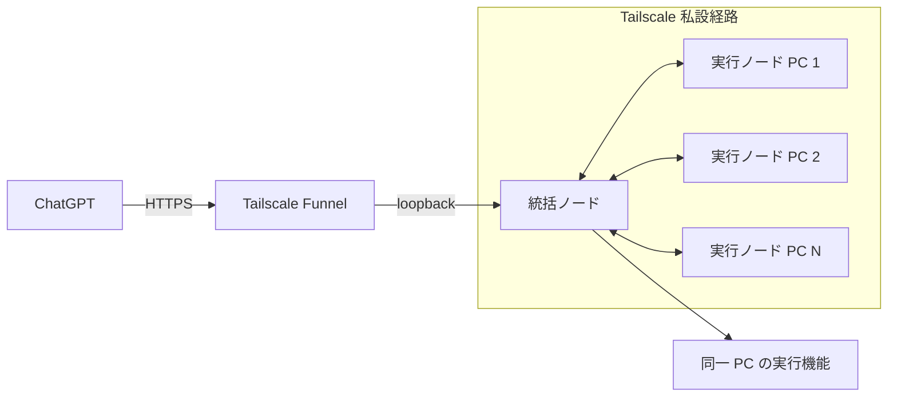
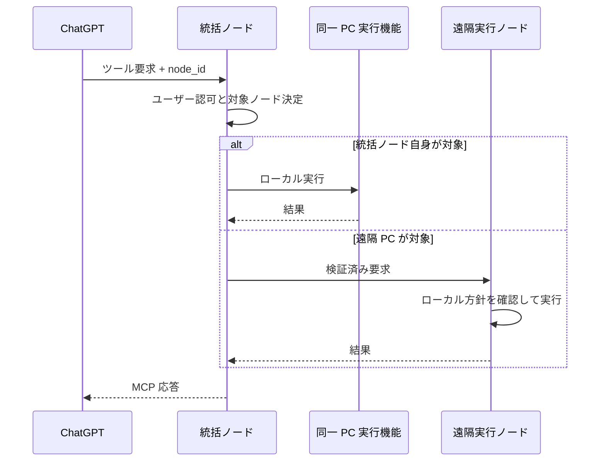

# 複数 PC 接続設計

## 目的

1つの ChatGPT 接続から、複数の PC 上で動作する RemoteDesktopMCP を操作できるようにする。

外部へ公開する MCP サーバーは1つに集約し、そのサーバーが要求の対象 PC を選択して各 PC へ処理を振り分ける。

## 役割

各 PC では同じ RemoteDesktopMCP を動作させ、設定によって次の役割を持たせる。

- 統括ノード: ChatGPT からの MCP 接続、ユーザー認証、対象ノード選択、要求振り分けを担当する。
- 実行ノード: 自分自身のファイル操作、プロセス操作、セッション管理を実行する。
- 兼任ノード: 統括ノードと実行ノードの両方を同一 PC 上で担当する。

初期版では、1構成につき有効な統括ノードは1台とする。
実行ノードは複数台登録できる。
統括ノード自身も実行ノードを兼任できることを必須とする。

構成例:

| PC | 役割 |
| --- | --- |
| PC A | 統括ノード + 実行ノード |
| PC B | 実行ノード |
| PC C | 実行ノード |

設定上は同じ RemoteDesktopMCP に役割を持たせる。
統括ノードだけを行う構成、実行ノードだけを行う構成、両方を兼任する構成を選べるようにする。

概念例:

```yaml
roles:
  - coordinator
  - executor
```

## 全体構成図



ChatGPT から見える MCP 接続先は統括ノードだけとする。
各実行ノードを ChatGPT へ個別登録する構成は初期版では採用しない。

実行ノード側では Tailscale Funnel を有効にしない。
外部公開は統括ノードだけに限定する。

## ノード間接続

遠隔の実行ノードは Tailscale の tailnet 内で統括ノードへ接続する。
インターネットへ直接待ち受けるポートは設けない。

実行ノードから統括ノードへ持続接続を開始し、その接続を双方向に利用して要求と結果を転送する構成を基本とする。
これにより、実行ノード側で受信用の公開設定を追加する必要をなくす。

統括ノードは次を管理する。

- 接続済み実行ノード一覧
- 各ノードの一意識別子
- 表示名
- 接続状態
- 最終確認時刻
- 利用可能な操作種別
- 実行中処理との対応関係

統括ノードと実行ノード間の接続は、Tailscale の暗号化だけを認証根拠にしない。
RemoteDesktopMCP 自身でも相互に接続相手を検証する。

## ノード識別

各実行ノードはローカルで生成した不変の `node_id` を持つ。

人が識別するための表示名も持たせる。
表示名は `pc1`、`workstation` など任意に設定できるが、処理の振り分けには `node_id` を使用する。

最低限保持する情報は次とする。

- `node_id`
- 表示名
- 役割
- ノード認証用公開情報
- 最終確認時刻
- 接続状態
- 利用可能な操作種別

`node_id`、ノード認証設定、統括ノード設定はローカル操作からだけ変更できるようにする。
MCP ツールから登録、削除、書き換えはできない。

## ノード認証

各ノードは個別の認証情報を持つ。

初期版では、統括ノードが許可済み実行ノードの `node_id` と認証用公開情報をローカル設定として保持する。
各実行ノードも接続先統括ノードの認証用公開情報をローカル設定として保持する。

ノード接続時は相互に相手を検証し、許可されていないノードからの接続を拒否する。

ノード認証情報の追加、削除、変更は対象 PC のローカル操作だけで行う。
ChatGPT 経由で新しい PC を登録できる管理ツールは作らない。

ユーザー認証は統括ノードで一度だけ行う。
実行ノードへはユーザーのアクセストークンそのものを転送せず、統括ノードが検証済み要求として必要情報だけを渡す。

## 要求の振り分け

ファイル操作とプロセス操作には対象ノードを指定できるようにする。

既存ツールには `node_id` を追加する。

- `file_search`
- `content_search`
- `file_read`
- `file_patch`
- `process_start`
- `process_status`
- `process_output`
- `process_kill`

実行可能なノードが1台だけの場合は `node_id` を省略できる。
2台以上存在する場合、省略時は推測して実行せず、対象ノード指定が必要な失敗を返す。

表示名は候補提示に使用できるが、最終的な実行対象は `node_id` で確定する。

## 要求処理図



統括ノード自身を対象にした場合も、遠隔ノードと同じ認可と監査経路を通す。

## ノード管理ツール

初期版では次の MCP ツールを追加する。

- `node_list`

`node_list` は、利用者が操作可能な実行ノードについて次を返す。

- `node_id`
- 表示名
- 接続状態
- 統括ノードとの兼任有無
- 利用可能な操作種別
- 最終確認時刻

ノード登録や設定変更のツールは提供しない。

## セッションとプロセス

1つの ChatGPT セッションから複数ノードを操作できるようにする。
セッション自体は統括ノードが管理し、各操作記録に対象 `node_id` を付与する。
プロセスは必ず起動元ノードと関連付ける。
異なる PC では OS の PID が重複し得るため、外部へ返すプロセス識別子はノードをまたいで一意な論理識別子とする。

統括ノードは論理プロセス識別子から、実行ノードとそのノード上の実プロセスへ対応付ける。

## ファイル操作の制約

許可 root、書き込み可否、検索対象などのファイル操作方針は各実行ノードがローカル設定として持つ。

統括ノードからの要求であっても、実行ノード自身のローカル方針を超える操作は許可しない。

同じパス文字列が複数 PC に存在しても同一ファイルとは扱わない。
ファイルは `node_id` とローカルパスの組で識別する。

PC 間ファイル転送は初期版の対象外とする。

## ログ

統括ノードは少なくとも次を記録する。

- ユーザー識別子
- セッション識別子
- 対象 `node_id`
- 要求種別
- 振り分け結果
- 成功、拒否、失敗
- 実行ノードから返された結果状態

実行ノードも、自ノードで実行した操作をローカル監査ログへ記録する。

同じ操作を統括ノードと実行ノードのログで追跡できるよう、要求ごとに共通の `request_id` を付与する。

## 統括ノード兼任時

統括ノード自身を対象にした要求では、外部の実行ノードへ通信せず同一プロセス内の実行機能へ振り分けてよい。
ただし、認証、認可、対象ノード決定、ローカル方針確認、監査ログ記録は遠隔ノードと同じ処理経路を通す。
兼任時だけ検査を省略する実装にはしない。

## 障害時の扱い

実行ノードが切断された場合、そのノードを切断状態として扱い、新しい操作を送らない。
実行中処理の状態が不明になった場合は成功と推測せず、状態不明として返す。

統括ノードが停止した場合、ChatGPT から全実行ノードへの操作はできなくなる。
初期版では統括ノードの自動切り替えは実装しない。

実行ノードは統括ノードとの接続が復旧したとき、自身の `node_id` で再接続する。

## 初期版の対象外

- 統括ノードの自動切り替え
- 複数統括ノードの同時稼働
- 1操作の複数ノード同時実行
- PC 間ファイル転送
- ChatGPT からのノード登録・削除

## 検証項目

実装後は最低限次を確認する。

1. ChatGPT から1つの MCP 接続だけで複数実行ノードを列挙できる。
2. PC 1 と PC 2 に同じパスが存在しても、指定したノードだけを操作する。
3. 実行ノードが2台以上あるとき、対象未指定の破壊的操作を実行しない。
4. 統括ノード自身を実行ノードとして操作できる。
5. 遠隔実行ノードは Tailscale Funnel を公開しなくても操作できる。
6. 未登録ノードからの接続を拒否する。
7. 実行ノード切断時に別ノードへ誤って処理を振り替えない。
8. 同じ操作を統括ノードと実行ノードの監査ログで追跡できる。
