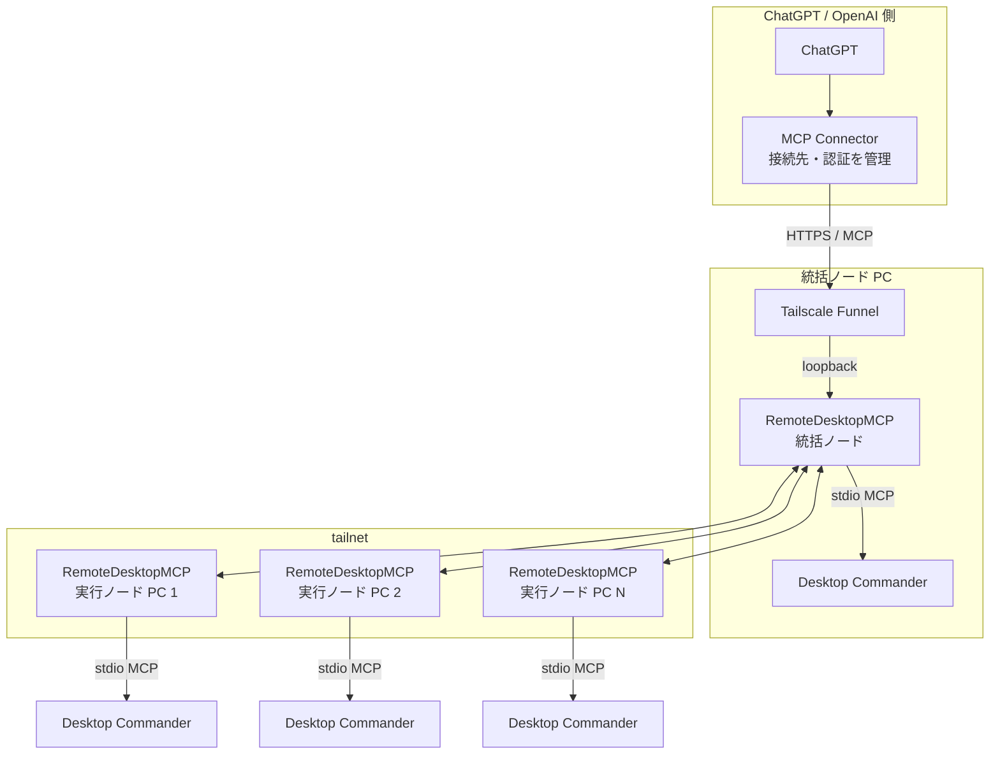
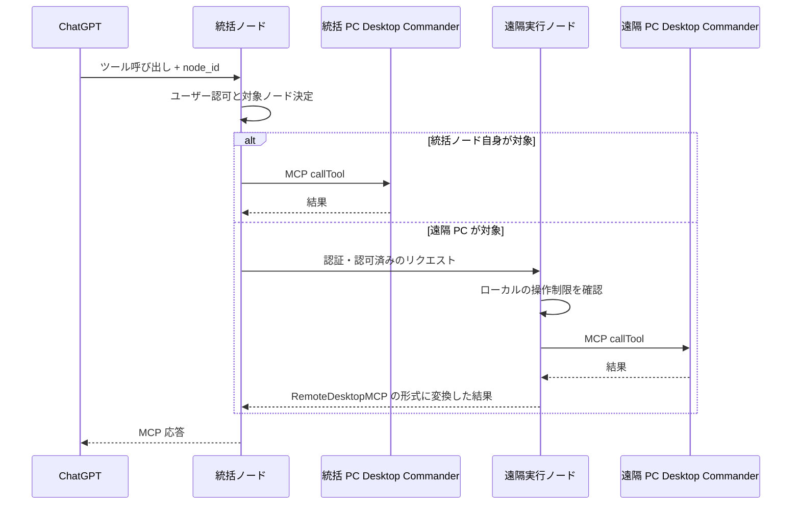

# 複数 PC 接続設計

## 目的

1つの ChatGPT 接続から、複数の PC 上で動作する RemoteDesktopMCP を操作できるようにする。

外部へ公開する MCP サーバーは1つに集約し、そのサーバーが操作対象のPCを選び、各PCへリクエストを振り分ける。

## 役割

各 PC では同じ RemoteDesktopMCP を動作させ、設定によって次の役割を持たせる。

- 統括ノード: ChatGPT からの MCP 接続、ユーザー認証、RemoteDesktopMCP セッション管理、対象ノードの選択、リクエストの振り分けを担当する。
- 実行ノード: 各PCの操作制限を確認し、実際のファイル操作とプロセス操作はローカルの `@wonderwhy-er/desktop-commander` に実行させる。
- 兼任ノード: 統括ノードと実行ノードの両方を同一 PC 上で担当する。

初期版では、1つの構成に統括ノードを1台だけ置く。
実行ノードは複数台登録できる。
統括ノード自身を実行ノードとして使う構成にも対応する。

構成例:

| PC | 役割 |
| --- | --- |
| PC A | 統括ノード + 実行ノード |
| PC B | 実行ノード |
| PC C | 実行ノード |

どのPCでも同じ RemoteDesktopMCP を動かし、設定によって統括ノード、実行ノード、または両方の役割を選べるようにする。

概念例:

```yaml
roles:
  - coordinator
  - executor
```

## 全体構成図



MCP Connector は ChatGPT / OpenAI 側にあり、RemoteDesktopMCP の接続先と認証を扱う。
RemoteDesktopMCP の MCP サーバー本体は統括ノード PC 上で動作する。

ChatGPT から見える MCP 接続先は統括ノードだけとする。
各実行ノードを ChatGPT へ個別登録する構成は初期版では採用しない。

実行ノード側では Tailscale Funnel を有効にしない。
外部公開は統括ノードだけに限定する。

## ノード間接続

遠隔の実行ノードは Tailscale の tailnet 内で統括ノードへ接続する。
インターネットへ直接待ち受けるポートは設けない。

実行ノードから統括ノードへ接続し、その接続を維持したまま双方向にリクエストと結果をやり取りする構成を基本とする。
これにより、実行ノード側で受信用の公開設定を追加する必要をなくす。

統括ノードは次を管理する。

- 接続済み実行ノード一覧
- `node_id`
- 表示名
- 接続状態
- 最終確認時刻
- 利用可能な操作種別
- 実行中プロセスとの対応

Tailscale で通信が暗号化されているだけでは、接続相手を信頼済みとはみなさない。
RemoteDesktopMCP 側でも統括ノードと実行ノードを相互認証する。

## ノード識別

各実行ノードは、再起動後も変わらない `node_id` をローカルで生成して保持する。

管理者がPCを見分けやすいよう、表示名も設定できるようにする。
表示名は `pc1`、`workstation` など任意に設定できるが、実際の処理先は `node_id` で特定する。

最低限、次の情報を保持する。

- `node_id`
- 表示名
- 役割
- ノード認証情報
- 最終確認時刻
- 接続状態
- 利用可能な操作

`node_id`、ノード認証設定、統括ノード設定はローカル操作からだけ変更できるようにする。
MCP ツールから登録、削除、書き換えはできない。

## ノード認証

### 何を確認するか

ノード認証では、統括ノードと実行ノードが互いに、事前に登録した接続相手であることを確認する。
Tailscale に接続できるだけでは、RemoteDesktopMCP の操作を許可しない。

ユーザーの認証・認可とは役割が異なる。
ユーザーの認証・認可は統括ノードが担当し、実行ノードへは確認済みのリクエストに必要な情報だけを渡す。
ユーザーのアクセストークンそのものは実行ノードへ転送しない。

### 認証に使う鍵と値

| 名前 | この設計での役割 |
| --- | --- |
| 事前共有鍵（PSK） | 接続前に両方のPCへ設定する秘密の鍵。同じ鍵を持つ相手かどうかの確認に使う |
| nonce | 接続のたびに作る使い捨ての乱数。以前の認証メッセージを使い回せないようにする |
| HMAC値 | 鍵とメッセージから計算する認証用の値。受信側も計算し、受け取った値と一致するか確認する |
| セッション鍵 | 認証後のノード間通信で使う、その接続専用の鍵。PSKと双方のnonceから生成する |

ここでいうセッション鍵は、ノード間の接続に使う鍵であり、ユーザーの操作をまとめる `session_id` とは別のものである。
HMACはメッセージの認証に使い、通信内容の暗号化と通信経路の保護は引き続き Tailscale が担当する。

### 接続前の準備

管理者は、統括ノードと実行ノードの組ごとに異なるPSKを設定する。
PSKは暗号学的に安全な乱数32バイトを `base64url` で表現した値とする。

統括ノードは、許可する実行ノードの `node_id` とPSKを対応付けて保存する。
各実行ノードは、接続先の統括ノード用PSKを1件だけ保持する。
複数の実行ノードで同じPSKを使い回さない。

### 接続時のやり取り

PSKそのものを接続相手へ送るのではなく、PSKから計算したHMAC値を照合する。
以下の手順では、まず実行ノードが統括ノードを確認し、次に統括ノードが実行ノードを確認する。

1. 実行ノードは `client_nonce` を生成し、プロトコルのバージョン、`node_id` とともに統括ノードへ送る。
2. 統括ノードは `node_id` に対応するPSKを取得し、`server_nonce` を生成する。PSKと双方のnonceを使ってHMAC値を計算し、`server_nonce` とHMAC値を返す。
3. 実行ノードは、自分が保持するPSKで同じ計算を行い、統括ノードから受け取ったHMAC値と照合する。
4. 照合に成功した実行ノードは、今度は実行ノード用のHMAC値を計算し、統括ノードへ返す。
5. 統括ノードも受け取ったHMAC値を照合する。双方の照合が成功した場合だけ、認証済みの接続として操作を受け付ける。

`client_nonce` と `server_nonce` は、接続のたびに新しく生成する、暗号学的に安全な乱数である。
以前の認証メッセージを再送しても、今回のnonceを使った計算結果とは一致しないため受け付けない。
認証が完了するまでは、ファイル操作、プロセス操作、ノード状態更新を受け付けない。
照合に失敗した場合は接続を閉じ、リクエストを実行しない。

#### 接続時のHMAC計算

双方とも、PSKを鍵として `HMAC-SHA-256` を計算する。
入力に含める役割名を変え、統括ノードの返答と実行ノードの返答を区別する。

統括ノードが返すHMAC値の入力:

```text
rdmcp-node-auth-v1|coordinator|node_id|client_nonce|server_nonce
```

実行ノードが返すHMAC値の入力:

```text
rdmcp-node-auth-v1|executor|node_id|client_nonce|server_nonce
```

### 認証後の通信

認証後も、接続を開始したときの確認結果だけでリクエストを実行するわけではない。
各リクエストと応答にHMAC値を付け、メッセージが変更されていないことを受信側で確認する。
さらに接続IDと送信順序を確認し、以前のメッセージを再送するリプレイ攻撃を防ぐ。

まず双方が、PSKと今回のnonceから同じセッション鍵を生成する。
`HKDF-SHA-256` に渡す値は次のとおりとする。

| 入力項目 | 値 |
| --- | --- |
| 元になる鍵 | PSK |
| 接続ごとの乱数（`salt`） | `client_nonce \|\| server_nonce` |
| 鍵の用途を示す追加情報 | `rdmcp-node-session-v1` |

式中の `||` は値を順に連結することを表す。
接続IDも双方が同じ式で計算する。

```text
connection_id = base64url(SHA-256("rdmcp-node-connection-v1" || client_nonce || server_nonce))
```

ノード間で送る各メッセージには、次の情報を含める。

| 項目 | 内容 |
| --- | --- |
| `connection_id` | どの接続のメッセージかを示すID |
| 送信方向 | 統括ノードから実行ノードへ送るか、その逆か |
| `sequence` | 送信方向ごとに1から増加する番号 |
| `request_id` | リクエストと応答を対応付けるID |
| メッセージ本文 | 実行する操作、またはその結果 |

本文のハッシュ値を計算し、セッション鍵を鍵とする `HMAC-SHA-256` で以下の入力を認証する。

```text
body_hash = SHA-256(body_bytes)
rdmcp-node-frame-v1|connection_id|direction|sequence|request_id|body_hash
```

受信側は、接続IDが異なるメッセージ、HMAC値が一致しないメッセージを拒否する。
また、同じ送信方向で直前に受け付けた `sequence` 以下の番号を持つメッセージも拒否する。

### 鍵の保管・更新と登録解除

PSKは認証設定に保存し、サーバープロセスを実行するOSユーザーだけが読み取れる権限にする。
認証設定の保存先を、ファイル操作ツールの許可範囲に含めない。

| 作業 | 管理者が行う操作 |
| --- | --- |
| 新しい実行ノードの登録 | 統括ノード上でPSKを生成し、安全な方法で対象PCのローカル設定にも同じ値を設定する |
| PSKの更新 | 対象ノードとの接続を停止し、両方のPCへ新しいPSKを設定してから再接続する。新旧のPSKは同時に有効にせず、設定が揃うまでは接続できなくてよい |
| ノード登録の解除 | 統括ノードから対象の `node_id` とPSKを削除し、既存接続も直ちに切断する。実行ノード側で接続先の認証情報を削除した場合も、再接続しない |

これらの変更はローカル操作で行う。
ノード登録用のMCPツール、公開HTTP管理API、自動参加機能は作らない。

### 認証結果の記録

監査ログには、対象の `node_id`、認証結果、失敗した処理段階を記録する。
PSK、nonce、HMAC値、セッション鍵はログへ出力しない。

HMACと鍵生成の用語・計算方法は、[HMACの仕様](https://www.rfc-editor.org/rfc/rfc2104.html)と[鍵生成の仕様](https://www.rfc-editor.org/rfc/rfc5869.html)を参照する。

## Desktop Commander の利用

実行ノードはファイル操作とプロセス操作の実行機能を独自実装しない。
ローカルの `@wonderwhy-er/desktop-commander` を `stdio` MCP サーバーとして起動または接続し、RemoteDesktopMCP が MCP クライアントとして利用する。

この構成は Desktop Commander の Remote Device と同様に、ローカル MCP を起動して `listTools()` と `callTool()` で操作する。
RemoteDesktopMCP から Desktop Commander の内部実装を直接 `import` せず、Desktop Commander との連携は MCP インターフェースだけに依存する。

### プロセス実行の権限モデル

初期版では、RemoteDesktopMCP、Desktop Commander、`process_start` から起動するプロセスを
同じ OS ユーザーで動かしてよい。
`process_start` で起動したコマンドは、その OS ユーザーが持つ権限をそのまま使う。

認証済みの許可ユーザーは、`process_start` を通して
RemoteDesktopMCP を起動した OS ユーザーと同等の権限を行使できるものとして扱う。
その OS ユーザーが読み書きできるファイル、設定、環境変数などは、
任意コマンドからも到達できる可能性がある。

`file_search`、`content_search`、`file_read`、`file_patch` の
許可ディレクトリはファイル操作ツールの範囲を制限するためのものであり、
`process_start` から起動する任意コマンドの実行範囲を制限する仕組みではない。

この権限を許可ユーザーへ与えられないPCでは、
運用者が RemoteDesktopMCP 自体を必要な範囲まで権限を下げた OS ユーザーで起動する。

別 OS ユーザーや OS のアクセス権を使った追加隔離を導入してもよいが、
初期版の必須構成にはしない。
追加隔離を導入していないことだけを理由に `process_start` を利用不可にはしない。

起動時は次を行う。

1. 初期版の検証対象を `@wonderwhy-er/desktop-commander` 0.2.50 とする。導入時は検証済みのバージョンを固定し、実行コマンドと引数はローカル設定で指定する。本番環境で自動的に `latest` へ更新しない。
2. MCP クライアントから `listTools()` を実行し、必要なツール名と入力定義が存在することを確認する。
3. その実行ノードで利用できる RemoteDesktopMCP 操作を統括ノードへ通知する。
4. 必要な Desktop Commander ツールがない操作は利用できないものとし、RemoteDesktopMCP の独自実装へ自動的に切り替えない。

初期版で各公開操作から呼び出す Desktop Commander ツールは次のとおり。

| RemoteDesktopMCP 公開操作 | 呼び出す Desktop Commander ツール | RemoteDesktopMCP 側の処理 |
| --- | --- | --- |
| `file_search` | `start_search` (`searchType="files"`), `get_more_search_results`, `stop_search` | `node_id`、`session_id`、許可ディレクトリを確認し、検索結果を RemoteDesktopMCP の返却形式へ変換する |
| `content_search` | `start_search` (`searchType="content"`), `get_more_search_results`, `stop_search` | 検索範囲と結果数を制限し、Desktop Commander の検索IDを外部APIの仕様にしない |
| `file_read` | `read_file` | 許可ディレクトリを確認し、引数と結果を RemoteDesktopMCP の形式へ変換する |
| `file_patch` | `edit_block` | 書き込み可否を確認し、部分変更だけを許可する |
| `process_start` | `start_process` | RemoteDesktopMCP の論理プロセスIDと Desktop Commander の PID を対応付ける |
| `process_status` | `list_sessions`, `read_process_output` | Desktop Commander の状態を RemoteDesktopMCP の状態へ変換する |
| `process_output` | `read_process_output` | 統合出力、実行状態、取得できる場合は終了コードを RemoteDesktopMCP の形式へ変換する。stdout / stderr の区分は推測しない |
| `process_kill` | `force_terminate` | 論理プロセスIDから起動元ノードと PID を特定して停止する |

### プロセス出力仕様

初期版では、固定した Desktop Commander 版の `read_process_output` が返す統合出力を仕様の基準とする。
`process_output` は初期版で少なくとも次の値を返す。

- `output`: Desktop Commander から取得した統合出力
- `state`: 実行中、終了、状態不明などの RemoteDesktopMCP 側の状態
- `exit_code`: Desktop Commander から取得できた終了コード。実行中または不明の場合は `null`

初期版では `stdout` と `stderr` を個別の項目として返さない。
統合出力の各行を stdout または stderr と推測して分類せず、Desktop Commander が保持していない stdout / stderr の区分情報を作らない。
将来、Desktop Commander が stdout / stderr を区別した出力を安定して返せるようになった場合は、RemoteDesktopMCP の公開仕様を拡張してよい。

固定する Desktop Commander のバージョンを更新するときは、更新前にプロセス出力仕様を自動テストする。
検証用プロセスで stdout と stderr の両方へ別々の文字列を出力して終了させる。`read_process_output` が両方を統合出力として返すこと、終了状態と終了コードを取得できること、RemoteDesktopMCP が stdout / stderr の区分を推測して追加しないことを確認する。
この検証を満たさない版へは更新しない。

Desktop Commander は、ユーザー認証・認可、`session_id`、`node_id`、監査、各PCの操作制限をすべて確認した後にだけ `callTool()` で呼び出す。
Desktop Commander のツールをそのまま外部公開せず、上表で定義した RemoteDesktopMCP の操作だけを MCP ツールとして公開する。

Desktop Commander の `allowedDirectories` などローカル設定は対象 PC の管理者がローカルで管理する。
RemoteDesktopMCP 側の許可ディレクトリと書き込み制限は、Desktop Commander と同じか、より厳しい範囲に設定できる。
どちらかの制限に違反するリクエストは拒否する。また、RemoteDesktopMCP から `set_config_value` など Desktop Commander の設定変更ツールは公開しない。

Desktop Commander のサーバー設定ファイルは、可能な限り Desktop Commander と RemoteDesktopMCP の許可ディレクトリ外に置く。
さらに各実行ノードは設定ファイルの実体パスをローカル設定で保持し、`file_search`、`content_search`、`file_read`、`file_patch`、`file_transfer_*` の対象から必ず除外する。
検索範囲に設定ファイルを含める構成は許可しないため、内容検索が設定ファイルを走査してから結果だけ除外する実装にはしない。
この保護対象パスは外部APIや監査ログへ出力しない。

RemoteDesktopMCP が担当する機能は、Desktop Commander が提供しない次のものに限定する。

- 外部ユーザーの OAuth/OIDC 認証と認可
- RemoteDesktopMCP の `session_id` 管理
- `node_id` の登録、認証、リクエストの振り分け
- `request_id` を使った統括ノードと実行ノードの監査ログの関連付け
- 外部公開するツールと引数の制限
- 複数PC間で一意な論理プロセスIDと、各PC上の PID との対応管理
- ChatGPT と対象PCの間で行うバイナリファイル転送
- Tailscale Funnel を使った外部公開

通常の検索、読取、部分編集、プロセス操作は Desktop Commander へ委譲し、
RemoteDesktopMCP 側で同等機能を重複実装しない。

ファイル転送だけは例外とする。
Desktop Commander の現在の公開ツールには、任意のバイナリファイルを
MCP越しに分割送受信する専用の転送機能がないため、
RemoteDesktopMCP が転送に必要なバイト列の読込み・一時ファイルへの書込みだけを担当する。
この例外から検索、テキスト編集、一般的なファイル管理機能へ範囲を広げない。

## ファイル転送

### 基本方式

初期版のファイル転送は、ChatGPT と RemoteDesktopMCP の間で既に確立している
MCP 接続上で完結させる。
追加の公開ポート、転送専用サーバー、一時的な外部URLは必須にしない。

転送開始時に暗号学的に安全な乱数から `transfer_id` を生成する。
転送状態には少なくとも次を保持する。

- `transfer_id`
- 転送方向
- `session_id`
- `node_id`
- 対象パス
- ファイル名
- ファイルサイズ
- SHA-256
- 作成時刻
- 最終操作時刻
- 次に受け付ける位置
- 状態

`transfer_id` は作成元の `session_id` と `node_id` に固定する。
後続の転送ツールでも有効な `session_id` を要求し、
別セッションや別ノードへ転送先を差し替えられないようにする。
元のセッションが終了または期限切れになった転送は継続しない。

初期版の転送ツールは次のとおり。

| ツール | 主な入力 | 主な結果 |
| --- | --- | --- |
| `file_transfer_download_begin` | `session_id`, `node_id`, パス | `transfer_id`, ファイル名, サイズ, SHA-256, チャンクサイズ |
| `file_transfer_download_chunk` | `session_id`, `transfer_id`, 位置 | base64データ, 次の位置, 完了有無 |
| `file_transfer_upload_begin` | `session_id`, `node_id`, 転送先, サイズ, SHA-256, 上書き可否 | `transfer_id`, チャンクサイズ |
| `file_transfer_upload_chunk` | `session_id`, `transfer_id`, 位置, base64データ | 次の位置 |
| `file_transfer_upload_commit` | `session_id`, `transfer_id` | 確定サイズ, SHA-256 |
| `file_transfer_status` | `session_id`, `transfer_id` | 状態, 次の位置, 転送済みサイズ |
| `file_transfer_cancel` | `session_id`, `transfer_id` | 中断結果 |

ファイル本体はチャンクに分割し、MCP ツールの引数または結果では base64 で表現する。
チャンクサイズはサーバーが返し、初期値は256 KiBを目安とする。
実装時にMCPクライアント側のメッセージ上限を確認し、設定で小さくできるようにする。

### ダウンロード

`file_transfer_download_begin` は対象ファイルを検証し、
ファイル名、サイズ、SHA-256、チャンクサイズと `transfer_id` を返す。

`file_transfer_download_chunk` は `transfer_id` と位置を受け取り、
その位置からのバイト列と次の位置を返す。
転送開始時のサイズまたは更新時刻が変化した場合は、同じファイルの転送を継続せず失敗とする。

### アップロード

`file_transfer_upload_begin` は転送先、期待サイズ、期待SHA-256、
上書き可否を受け取り、`transfer_id` とチャンクサイズを返す。

受信データは転送先と同じディレクトリの一時ファイルへ順番に書き込む。
`file_transfer_upload_chunk` は次に受け付ける位置と一致するチャンクだけを受け付ける。
初期版では並列チャンク書込みを行わない。

`file_transfer_upload_commit` で受信サイズとSHA-256を検証する。
一致した場合だけ一時ファイルを転送先へ置き換える。
既存ファイルの上書きは、転送開始時に明示的に許可された場合だけ行う。
検証に失敗した場合は転送先を変更せず、一時ファイルを破棄する。

### 中断と期限

`file_transfer_status` は現在の状態と次の位置を返す。
同じ RemoteDesktopMCP プロセスが動作している間は、
クライアントが `file_transfer_status` で位置を確認して転送を再開できるようにする。

一定時間操作されていない転送は期限切れにする。
`file_transfer_cancel` または期限切れになったアップロードは一時ファイルを削除する。
RemoteDesktopMCP 再起動前の `transfer_id` は再利用しない。

### 複数PCでの転送経路

統括ノード自身が対象の場合は、そのPC上で直接チャンクを処理する。
遠隔実行ノードが対象の場合は、統括ノードが `transfer_id` と各チャンクを
既存のノード間接続で対象実行ノードへ中継する。

遠隔実行ノードを外部公開したり、ChatGPT から遠隔実行ノードへ
直接接続したりしない。
外部から見える接続先は、通常のツール呼び出しと同じく統括ノード1台だけとする。

### パス制限

ファイル転送には、その実行ノードのファイル操作と同じ許可ディレクトリを適用する。
パスを正規化し、シンボリックリンク等を解決した実体パスで許可範囲を確認する。

Desktop Commander のサーバー設定ファイルは、
通常の `file_*` とファイル転送の両方から明示的に除外する。
設定ファイルの実体パスは各実行ノードのローカル設定で保持し、
許可ディレクトリ内に見える場合でも除外を優先する。

この除外は RemoteDesktopMCP のファイル操作と転送APIに適用する。
同じ OS ユーザー権限で動く `process_start` の任意コマンドからのアクセスまで
隔離するものではない。

### 監査

転送開始、完了、失敗、中断を監査ログへ記録する。
ログには `transfer_id`、転送方向、`session_id`、`node_id`、
対象パス、サイズ、SHA-256、結果を記録し、ファイル本体は記録しない。

### 現在の `src/index.ts` の扱い

現在の `src/index.ts` は最終構成ではなく、公開接続と認証の検証を開始するための暫定実装とする。
Desktop Commander の MCP ツール呼び出しへ置き換える段階で、重複するローカル操作は次のように整理する。

- `searchFiles()` と `readdir` / `stat` による探索は削除し、`file_search` / `content_search` から Desktop Commander の検索ツールを呼び出す。
- `launch_configured_process` 内の直接 `spawn` は削除する。固定起動設定を残す場合も、RemoteDesktopMCP 側で起動を許可してよい設定か確認した後に `start_process` を呼び出す。
- 現在の `create_file_download` と `/downloads/:token` による単発ダウンロードは、初期版の正式な転送方式にはしない。上記の `file_transfer_*` に置き換え、追加の一時HTTPエンドポイントを必要としないMCPチャンク転送へ統一する。
- `getRoot()` やパスの正規化処理は、RemoteDesktopMCP 側のアクセス制限を確認するために必要な範囲だけ残してよい。通常のファイル操作は直接実行しないが、`file_transfer_*` のバイナリ転送に必要な範囲では対象ファイルのバイト列を直接読み書きしてよい。
- OAuth/OIDC、RemoteDesktopMCP セッション、ノード振り分け、監査など RemoteDesktopMCP 固有の機能は引き続き本体で実装する。

## リクエストの振り分け

ファイル操作とプロセス操作には対象ノードを指定できるようにする。

既存のファイル操作、プロセス操作、ファイル転送には `node_id` を追加する。

- `file_search`
- `content_search`
- `file_read`
- `file_patch`
- `file_transfer_download_begin`
- `file_transfer_upload_begin`
- `process_start`
- `process_status`
- `process_output`
- `process_kill`

`file_transfer_download_chunk`、`file_transfer_upload_chunk`、`file_transfer_upload_commit`、`file_transfer_status`、`file_transfer_cancel` は、`transfer_id` に記録された `node_id` を使用し、呼び出し時に実行先を変更できないようにする。

構成に登録された実行ノードが1台だけの場合に限り `node_id` を省略できる。
この台数判定には統括ノード自身が兼任する実行ノードも含め、現在の接続状態は使わない。
登録済み実行ノードが2台以上ある場合、接続中のノードが1台だけでもファイル操作とプロセス操作の `node_id` を必須とする。
`node_id` が必要なのに指定されていない場合はエラーを返し、接続中のノードを推測して実行しない。

指定された `node_id` が登録済みでも切断中の場合は、対象ノードに接続できないエラーを返し、別のノードへ振り替えない。
登録済み実行ノードが1台だけで `node_id` が省略された場合も、そのノードが切断中なら接続できないエラーを返す。
表示名は画面表示やユーザーへの候補表示に使ってよいが、実行先の特定には必ず `node_id` を使う。

## リクエスト処理図



統括ノード自身が対象の場合も、遠隔ノードと同じ手順で認証・認可と監査を行う。

## ノード管理ツール

初期版では次の MCP ツールを追加する。

- `node_list`

`node_list` は、利用者が操作可能な実行ノードについて次を返す。

- `node_id`
- 表示名
- 接続状態
- 統括ノードとの兼任有無
- 利用可能な操作種別
- 最終確認時刻

ノード登録や設定変更のツールは提供しない。

## セッションとプロセス

セッションはユーザーの一連の操作を管理するためのもの、論理プロセスIDは起動したプロセスを特定するためのものである。
セッションが終了しても、そのセッションで起動したプロセスは停止しない。
プロセスを管理する際は、セッションの有効性とは別に、指定されたIDが現在もそのプロセスを指しているか確認する。

### セッションと起動元の記録

RemoteDesktopMCP のセッションは、MCP の通信セッションや個々の HTTP 接続とは別に統括ノードで管理する。
`session_open` で生成した `session_id` は、認証済みユーザーが一致し、有効期限内であれば別の HTTP 接続からも継続利用できる。
ファイル操作とプロセス操作では明示された `session_id` を使い、接続状態からセッションを自動生成したり自動選択したりしない。

統括ノードは各操作のログに `session_id` と対象の `node_id` を記録する。
遠隔実行ノードへはログを追跡するための `session_id` と `request_id` を渡すが、セッションの作成、期限管理、一覧表示は統括ノードだけが行う。
プロセスは必ず起動時の `session_id` と起動元ノードに関連付ける。
異なるPCでは同じ PID が使われることがあるため、外部へ返すプロセスIDは複数PCをまたいで一意になるよう RemoteDesktopMCP が生成する。

### プロセスの識別に使うID

PIDだけでは対象を安全に特定できない。
異なるPCで同じPIDが使われるほか、同じPCでも終了したプロセスのPIDが別のプロセスに再利用されることがある。
このため、以下の情報を組み合わせて管理する。

| 名前 | 何を表すか |
| --- | --- |
| 論理プロセスID | 利用者が状態確認・出力取得・停止の際に指定する、RemoteDesktopMCP が発行するID |
| `node_id` | どのPCで起動したか |
| `desktop_commander_generation` | どの Desktop Commander 接続で起動したかを表す世代ID |
| `pid` | そのPC上のプロセス番号 |

統括ノードは、外部へ返す論理プロセスIDと、実際の実行先を対応付けて管理する。
対応表には少なくとも `{ node_id, desktop_commander_generation, pid }` を保持する。
論理プロセスIDには PID をそのまま使わず、RemoteDesktopMCP が生成した一意のIDを使う。

各実行ノードは、現在接続している Desktop Commander の世代を表す `desktop_commander_generation` を持つ。
この世代IDは、Desktop Commander との新しい接続を確立するたびに、暗号学的に安全な乱数16バイトから生成する。
Desktop Commander の子プロセスまたは `stdio` 接続を作り直した場合は新しい世代IDを生成し、以前の値は再利用しない。
統括ノードとの通信だけが再接続し、Desktop Commander との接続が継続している場合は世代IDを変えない。
実行ノード自身が再起動した場合も新しい世代IDを生成する。
実行ノードは現在の世代IDを統括ノードへ通知する。統括ノードが記録している世代IDと異なる場合は、以前の世代に属する実行中プロセスの対応を無効にする。

### 同じPIDが再利用された場合

同じノード、同じ世代、同じPIDに対応する論理プロセスIDは、現在有効なものを1件だけ保持する。
例えば、古いプロセスAのPIDを新しいプロセスBが使ったとき、Aの論理プロセスIDでBを停止できてはならない。
そのため、新しいIDを利用者へ返す前に古いIDを無効にする。

`process_start` が成功したら、`{ node_id, desktop_commander_generation, pid }` を `process_key` とし、そのキーに現在有効な論理プロセスIDを最大1件だけ対応付ける。
実装上、この現在有効なIDを `current_process_owner` として保持する。

新しい `process_start` が既存と同じ `process_key` を返した場合は、新しい論理プロセスIDを利用者へ返す前に、古いIDを `stale`（無効）にする。
その後、同じロック内で `current_process_owner` を新しい論理プロセスIDへ切り替える。
論理プロセスID自体は `process_start` 完了前に生成してよいが、切り替えが完了するまでは外部へ返さない。

`process_status`、`process_output`、`process_kill` から Desktop Commander を呼ぶのは、世代IDが現在の値と一致し、かつ指定された論理プロセスIDが `process_key` の `current_process_owner` と一致する場合だけとする。
どちらかが一致しないIDは `stale`（無効）として扱い、PID を Desktop Commander へ渡さない。
特に `process_kill` では、無効なIDに対して `force_terminate` を呼び出さない。

### プロセス操作の排他制御

同じ実行ノードかつ同じ Desktop Commander 世代に対するプロセス操作は、同時に1件だけ実行する。
排他制御の単位は `{ node_id, desktop_commander_generation }` とする。
初期版では並列実行より誤操作の防止を優先し、`process_start`、`process_status`、`process_output`、`process_kill` が同じ世代の Desktop Commander プロセス用ツールを同時に呼び出さないようにする。

`process_start` は、Desktop Commander の `start_process` を呼ぶ前にロックを取得する。
PID の取得、同じ PID を使っていた古い論理プロセスIDの無効化、新しい論理プロセスIDの登録、状態更新までを同じロック内で行う。
新しい論理プロセスIDは、これらの処理を完了してロックを解放した後に利用者へ返す。

`process_status`、`process_output`、`process_kill` が Desktop Commander へ PID を渡す場合も、同じロックを取得する。
ロック取得後に、世代IDが現在の値と一致することと、その論理プロセスIDが現在有効なIDであることを必ず確認し直す。
確認に成功した場合だけ Desktop Commander を呼び出し、その結果に基づく状態更新が終わるまでロックを保持する。
ロック取得前の確認結果だけで PID を Desktop Commander へ渡してはならない。

終了済みプロセスについて、保存済みの状態や出力だけを返す `process_status` と `process_output` は Desktop Commander を呼び出さないため、このロックは不要とする。
1つのリクエストで複数の排他単位を同時にロックしない。

### Desktop Commander との接続が切れた場合

Desktop Commander との接続が切れた場合は、その世代に属する実行中プロセスの対応をすべて `stale`（無効）にし、その世代の `current_process_owner` の対応表も削除する。
新しい Desktop Commander 接続で同じ PID が使われても、古い論理プロセスIDを新しいプロセスへ対応付け直さない。

### 終了を確認したプロセス

プロセスの終了を確認できた場合は、終了状態、取得済みの統合出力、取得できた終了コードを保存し、実行中プロセスの対応表から外す。
その論理プロセスIDが `current_process_owner` だった場合は、`current_process_owner` の対応も削除する。
終了済みプロセスの `process_status` と `process_output` は保存済みの結果から返し、`process_kill` は終了済みとして拒否する。
終了確認前に Desktop Commander との接続が切れた場合は、終了したと推測せず状態不明とする。

### セッションが終了した場合

RemoteDesktopMCP のセッションが終了または期限切れになっても、それだけを理由に実行中プロセスは停止しない。
同じユーザーの別の有効なセッションから論理プロセスIDを指定した場合は、上記の世代IDと現在有効なIDの確認を通過した場合だけ、状態確認、出力取得、停止を行えるようにする。

## ファイル操作の制約

許可ディレクトリ、書き込み可否、検索対象などのファイル操作制限は、各実行ノードのローカル設定で管理する。

統括ノードからのリクエストであっても、実行ノード側のローカル設定で許可していない操作は実行しない。

同じパスが複数PCに存在しても、同じファイルとは扱わない。
ファイルは `node_id` とローカルパスの組で識別する。

ファイル転送も同じパス制限を使用する。
Desktop Commander のサーバー設定ファイルは、通常のファイル操作とファイル転送の対象外とする。

## ログ

統括ノードは少なくとも次を記録する。

- ユーザーID
- セッションID
- 対象 `node_id`
- リクエスト種別
- 振り分け結果
- 成功、拒否、失敗
- 実行ノードから返された実行結果

実行ノード側にも、そのPCで実行した操作の監査ログを記録する。

同じ操作を統括ノードと実行ノードのログで追跡できるよう、リクエストごとに共通の `request_id` を付与する。

## 統括ノード自身を操作する場合

統括ノード自身が操作対象の場合は、外部の実行ノードへ送らず、同じPC上の Desktop Commander を `stdio` MCP で呼び出す。
ファイル操作やプロセス操作を RemoteDesktopMCP 本体へ重複実装しない。
認証、認可、対象ノードの決定、ローカルの操作制限確認、監査ログ記録は遠隔ノードと同じ手順で行う。
統括ノード自身を操作する場合も、RemoteDesktopMCP、Desktop Commander、`process_start` のプロセスを同じ OS ユーザーで動かしてよい。

## 障害発生時

実行ノードとの接続が切れた場合は、そのノードを切断状態として扱い、新しい操作を送らない。
実行中の処理結果を確認できない場合は、成功したと推測せず状態不明として返す。

実行ノード上の Desktop Commander 子プロセスまたは `stdio` MCP 接続が利用できなくなった場合、その間は該当する操作を実行できないものとする。
Desktop Commander との接続が切れたことを検出した時点で、現在の `desktop_commander_generation` に属する実行中プロセスの対応を `stale`（無効）にし、以後その PID を Desktop Commander へ渡さない。
RemoteDesktopMCP は再接続または Desktop Commander の再起動を試みてよい。新しい接続が利用可能になった時点で、新しい `desktop_commander_generation` を生成する。
新しい世代の Desktop Commander 接続が確立しても、古い世代のプロセス対応を復元しない。また、その間だけ RemoteDesktopMCP の直接実装へ切り替えることもしない。
処理中に Desktop Commander 接続が失われ、完了を確認できない場合は成功と推測せず状態不明として返す。

統括ノードが停止した場合、ChatGPT から全実行ノードへの操作はできなくなる。
初期版では統括ノードの自動切り替えは実装しない。

実行ノードは統括ノードとの接続が復旧したとき、自身の `node_id` で再接続する。

## 初期版の対象外

- 統括ノードの自動切り替え
- 複数統括ノードの同時稼働
- 1回の操作を複数ノードで同時に実行する機能
- ChatGPT からのノード登録・削除

## 検証項目

実装後は最低限次を確認する。

1. ChatGPT から1つの MCP 接続だけで複数の実行ノードを一覧表示できる。
2. PC 1 と PC 2 に同じパスが存在しても、指定したノードだけを操作する。
3. 実行ノードを2台以上登録し、そのうち1台だけが接続中のときも、`node_id` を省略したファイル操作とプロセス操作を拒否する。
4. 統括ノード自身を実行ノードとして操作できる。
5. 遠隔実行ノードは Tailscale Funnel を公開しなくても操作できる。
6. 未登録ノードからの接続を拒否する。
7. 実行ノードとの接続が切れた場合に、別のノードへ誤って処理を振り替えない。
8. 同じ操作を統括ノードと実行ノードの監査ログで追跡できる。
9. 実行ノードの起動時に `listTools()` で必要な Desktop Commander ツールを確認し、必要なツールがない操作は利用できないと通知する。
10. `file_*` と `process_*` の実行が Desktop Commander の `callTool()` を経由し、RemoteDesktopMCP 内の同等処理へ自動的に切り替わらない。
11. RemoteDesktopMCP が拒否するパスや操作は Desktop Commander が許可していても実行されず、Desktop Commander のローカル設定が拒否する操作も実行されない。
12. Desktop Commander の設定変更ツールや初期版で許可していないツールが外部 MCP へ公開されない。
13. 現在の `src/index.ts` にある直接探索と直接 `spawn` を Desktop Commander の MCP ツール呼び出しへ置き換え、既存の単発ダウンロードを `file_transfer_*` へ置き換えることを確認する。通常の検索、編集、プロセス操作を RemoteDesktopMCP 側へ重複実装しない。

### プロセス実行の権限モデル確認

初期版の基本構成として、RemoteDesktopMCP と Desktop Commander を同じ OS ユーザーで起動し、`process_start` が利用できることを確認する。

テスト用に、ファイル操作ツールの許可ディレクトリ外に、同じ OS ユーザーから読み取れる検証用ファイルを置く。
`file_read` ではそのファイルを拒否し、`process_start` から起動したコマンドでは同じファイルへアクセスできることを確認する。
これにより、ファイル操作ツールの許可ディレクトリが任意コマンドの実行範囲を制限するものではないことを確認する。

別 OS ユーザーや OS のアクセス権による追加隔離を導入した環境では、その隔離に固有の試験を別途行ってよい。
ただし、その追加隔離は初期版の合格条件には含めない。

### ファイル転送の確認

統括ノード自身と遠隔実行ノードの両方を対象に、ダウンロードとアップロードを確認する。

ダウンロードでは、テキストファイルとバイナリファイルについて、
開始時に返したサイズとSHA-256が転送後のファイルと一致することを確認する。
転送中に元ファイルを変更した場合は、同じ転送を成功として完了しないことを確認する。

アップロードでは、複数チャンクに分割したファイルを転送し、
`file_transfer_upload_commit` 後のサイズとSHA-256が送信元と一致することを確認する。
途中で中断した場合、転送先の完成ファイルが変更されず、一時ファイルが削除されることを確認する。
上書き許可なしで既存ファイルを指定した場合は拒否する。

転送を中断して `file_transfer_status` を取得し、
同じ RemoteDesktopMCP プロセス内では返された次の位置から再開できることを確認する。
別セッション、別ノード、期限切れの `transfer_id` は拒否する。

Desktop Commander のサーバー設定ファイルについて、
`file_search`、`content_search`、`file_read`、`file_patch` と
すべての `file_transfer_*` が対象にできないことを確認する。
設定ファイルを含むディレクトリを検索範囲として構成できないことも確認する。

外部公開される HTTP エンドポイントに転送専用のアップロード／ダウンロード用エンドポイントが追加されず、
ファイル本体が既存のMCP接続上だけで転送されることを確認する。

### プロセス出力の確認

固定した Desktop Commander バージョンで、stdout と stderr の両方へ識別用の文字列を出す検証用プロセスを実行する。
`read_process_output` と RemoteDesktopMCP の `process_output` について、次を確認する。

- 両方の文字列が1つの統合出力に含まれる。
- 終了状態と、取得可能な終了コードが返る。
- stdout / stderr の区分を推測して追加していない。

### Desktop Commander 再起動後のID

世代 `G1` で起動した論理プロセスIDを保持したまま、Desktop Commander を再起動して世代 `G2` に変更する。
`G2` に同じPIDのプロセスが存在しても、古いIDによる `process_status`、`process_output`、`process_kill` は `stale`（無効）となることを確認する。
これらの操作から `read_process_output` や `force_terminate` を呼び出してはならない。

### 終了済みプロセスの確認

終了を確認したプロセスが、実行中プロセスの対応表と `current_process_owner` から外れることを確認する。
その後の `process_status` と `process_output` は、保存済みの状態・統合出力・終了コードから返す。
`process_kill` は終了済みとして拒否する。

### 再起動せずに同じPIDを再利用した場合

Desktop Commander を再起動せず、世代 `G1` のまま検証する。
検証用実装から2回の `process_start` に同じPID `P` を順に返す。
1回目の終了を RemoteDesktopMCP がまだ確認していない状態で、2回目を開始する。

- 2回目の論理プロセスIDを返す前に、1回目のIDが `stale`（無効）になる。
- `current_process_owner[{node_id,G1,P}]` が2回目のIDだけを指す。
- 1回目のIDによる状態確認・出力取得・停止から、`read_process_output` や `force_terminate` を呼び出さない。

### プロセス操作が並行した場合

同じ実行ノードの世代 `G1` で、PID `P` に対応する現在有効な論理プロセスIDをAとする。
Aに対する `process_status`、`process_output`、`process_kill` を、それぞれ新しい `process_start` Bと並行して実行する。
Bは同じPID `P` を返すものとし、次の両方の順序を確認する。

**Aの操作が先にロックを取得する場合。** Aの Desktop Commander 呼び出しと状態更新が終わるまで、Bは `start_process` を呼び出せない。

**Bが先にロックを取得する場合。** Bが新しいIDを登録した後、待機していたAの操作がロックを取得する。
Aの操作はロック内の再確認でIDが無効だと判定し、`read_process_output` や `force_terminate` を呼び出さない。
