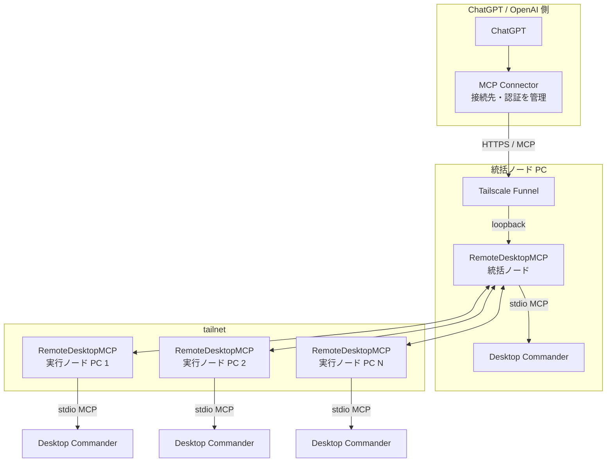
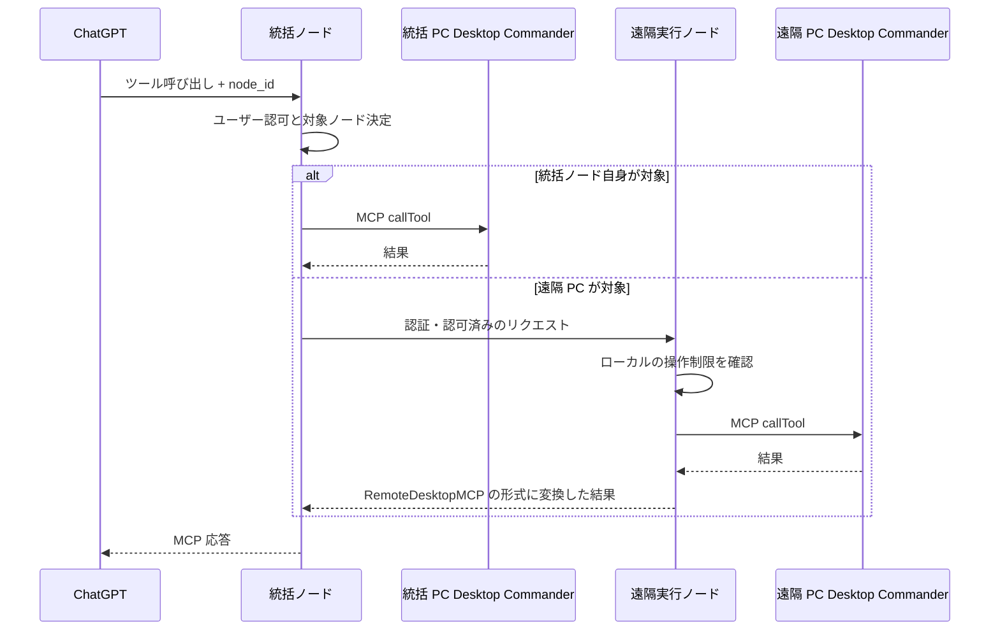

# 複数 PC 接続設計

## 目的

1つの ChatGPT 接続から、複数の PC 上で動作する RemoteDesktopMCP を操作できるようにする。

外部へ公開する MCP サーバーは1つに集約し、そのサーバーが操作対象のPCを選び、各PCへリクエストを振り分ける。

## 役割

各 PC では同じ RemoteDesktopMCP を動作させ、設定によって次の役割を持たせる。

- 統括ノード: ChatGPT からの MCP 接続、ユーザー認証、RemoteDesktopMCP セッション管理、対象ノードの選択、リクエストの振り分けを担当する。
- 実行ノード: 各PCの操作制限を確認し、実際のファイル操作とプロセス操作はローカルの `@wonderwhy-er/desktop-commander` に実行させる。
- 兼任ノード: 統括ノードと実行ノードの両方を同一 PC 上で担当する。

初期版では、1つの構成に統括ノードを1台だけ置く。
実行ノードは複数台登録できる。
統括ノード自身を実行ノードとして使う構成にも対応する。

### 稼働可能な最小段階

最初の稼働確認は、統括ノードと実行ノードを同じ1台のPC、同じ RemoteDesktopMCP プロセスで兼任する構成とする。
この段階ではローカル設定の1つの `node_id` だけを扱い、`node_list` はそのノードを返す。
ファイル操作、転送開始、プロセス操作でその `node_id` を明示でき、別の `node_id` は拒否する。
ループバックの MCP 接続、開発用の既存パスワード認証、セッションと監査、ローカルの Desktop Commander 委譲、ファイル転送はこの構成で実際に動作させる。
この段階はローカルでの稼働確認に限り、Tailscale Funnel での公開は行わない。
次に Google OIDC、CIMD、更新用トークンを含む公開認証を実装し、同じ1台のPCを ChatGPT から操作する。
遠隔実行ノードとの接続、複数ノードの登録と振り分け、ノード間中継は、その後に実装する。
この最小段階の完了をもって、外部公開や複数PC対応の完了とは扱わない。
以下の複数PC契約と検証項目は、次段階まで含む初期版全体の要件である。

構成例:

| PC | 役割 |
| --- | --- |
| PC A | 統括ノード + 実行ノード |
| PC B | 実行ノード |
| PC C | 実行ノード |

どのPCでも同じ RemoteDesktopMCP を動かし、設定によって統括ノード、実行ノード、または両方の役割を選べるようにする。

概念例:

```yaml
roles:
  - coordinator
  - executor
```

## 全体構成図


```mermaid
flowchart TB
    subgraph OpenAI["ChatGPT / OpenAI 側"]
        ChatGPT[ChatGPT]
        Connector["MCP Connector<br/>接続先・認証を管理"]
        ChatGPT --> Connector
    end

    Connector -->|HTTPS / MCP| Funnel[Tailscale Funnel]

    subgraph CoordinatorPC["統括ノード PC"]
        Funnel -->|loopback| C["RemoteDesktopMCP<br/>統括ノード"]
        C -->|stdio MCP| CD[Desktop Commander]
    end

    subgraph Tailnet[tailnet]
        C <--> P1["RemoteDesktopMCP<br/>実行ノード PC 1"]
        C <--> P2["RemoteDesktopMCP<br/>実行ノード PC 2"]
        C <--> PN["RemoteDesktopMCP<br/>実行ノード PC N"]
    end

    P1 -->|stdio MCP| P1D[Desktop Commander]
    P2 -->|stdio MCP| P2D[Desktop Commander]
    PN -->|stdio MCP| PND[Desktop Commander]
```

MCP Connector は ChatGPT / OpenAI 側にあり、RemoteDesktopMCP の接続先と認証を扱う。
RemoteDesktopMCP の MCP サーバー本体は統括ノード PC 上で動作する。

ChatGPT から見える MCP 接続先は統括ノードだけとする。
各実行ノードを ChatGPT へ個別登録する構成は初期版では採用しない。

実行ノード側では Tailscale Funnel を有効にしない。
外部公開は統括ノードだけに限定する。

## ノード間接続

遠隔の実行ノードは Tailscale の tailnet 内で統括ノードへ接続する。
インターネットへ直接待ち受けるポートは設けない。
実行ノード側では受信用のポートを開かず、実行ノードから統括ノードへ接続を開始する。

初期版のノード間通信方式は Node.js の TCP 接続とする。
統括ノードは外部 MCP 用のループバック HTTP 待ち受けとは別に、ノード間通信用の TCP 待ち受けを持つ。
待ち受け先は `tailscale ip -4` で確認した自端末の Tailscale IPv4 と設定済みポートだけとし、
`0.0.0.0`、LAN IP、グローバル IP では待ち受けない。
Tailscale IPv4 を取得できない場合は、遠隔実行ノード用待ち受けを開始しない。
実行ノードは統括ノードの tailnet 内アドレスまたは MagicDNS 名とポートをローカル設定に保持する。

TCP 上のメッセージは、4バイトの符号なしビッグエンディアン長と UTF-8 JSON 本文からなる長さ付きフレームで送る。
初期版の1フレーム上限は 32 MiB とする。
現行の `process_output` が最大2,097,152文字の保存済み出力を返し得るため、JSON の文字列表現の変換と
base64url 化を含めても通常の既存応答を格納できる上限として32 MiBを確保する。
宣言長が上限を超える場合や JSON として解釈できない場合は接続を閉じる。
送信しようとする `response` が外側の長さ付きフレームとして32 MiBを超える場合は、
実行ノードは元の応答本文を送らず、小さい `error` フレームで `NODE_RESPONSE_TOO_LARGE` を返す。
ファイル転送のチャンク上限は、JSON 化と base64url 化を含めてもこの上限を十分下回る値に制限する。

受信した JSON はフレーム種別ごとの入力形式に照合し、必須項目の欠落、型不一致、未知のフレーム種別を拒否する。
認証完了前に受け付けるフレーム種別は、後述するノード認証用メッセージだけとする。
認証前の接続は統括ノード全体で最大32本とし、それを超える接続は処理せず閉じる。
TCP 接続後10秒以内に相互認証と `ready` まで完了しない接続も閉じる。

実行ノードは接続を維持したまま双方向にリクエストと結果をやり取りする。
統括ノードは実行ノードごとに、操作可能な `active` 接続を最大1本と、置換候補の `synchronizing` 接続を最大1本だけ保持する。認証前の接続はこの2本とは別に全体上限32本で管理する。
同じ `node_id` から新しい接続が相互認証まで成功しても、`ready` と使用者状態の初期同期が完了するまでは現在の `active` 接続を置き換えない。同じノードに新しい置換候補がさらに到着した場合は、古い `synchronizing` 接続を閉じ、新しい候補だけを同期対象とする。
置換候補の認証、`ready`、使用者状態同期が失敗または期限切れになった場合は候補だけを閉じ、既存の `active` 接続が利用可能なら維持する。同期まで成功した時点で新しい接続を `active` へ原子的に昇格し、それまでの `active` 接続を閉じる。候補の `executor_generation` が旧 `active` 接続と異なる場合に限り、この昇格と同じ状態遷移で旧実行ノード世代を指す公開転送対応と公開プロセス対応を失効させる。候補が昇格する前には旧資源を失効させない。
各リクエストは送信時の `connection_id` に固定する。昇格によって閉じた旧 `active` 接続で応答待ちだった要求は `NODE_OUTCOME_UNKNOWN` とし、新しい接続へ自動再送しない。旧接続から遅れて到着した応答も現在の要求結果として採用しない。

認証後、統括ノードは通信がない間も15秒ごとに認証済みの生存確認を送り、
有効な応答または別の認証済みフレームを45秒間受信できなければ接続を切断状態にする。
実行ノードは通信断の後、再接続待ち時間を1、2、4、8、16、30秒の順で伸ばし、さらに小さな乱数待ちを加えて再接続する。
安定した接続が60秒続いた場合は待ち時間を初期値へ戻す。
未登録 `node_id`、PSK 不一致、未対応プロトコル版など設定変更が必要な拒否では、
再試行を1分に1回以下へ抑える。

接続断、要求待ち時間超過、または接続の世代交代によって、送信済み要求の完了を確認できなくなった場合は、
成功したと推測せず結果不明として扱う。
`file_patch`、アップロード確定、`process_start`、`process_kill` など副作用を持つ要求を自動再送しない。
利用者が明示的に再実行する場合も、直前の結果が不明であることを応答と監査ログで確認できるようにする。

統括ノードは次を管理する。

- 登録済み実行ノード一覧
- `node_id`
- 表示名
- 現在の `connection_id`
- 接続状態
- 最終確認時刻
- 利用可能な操作種別
- 実行中プロセスとの対応
- 送信済みで応答待ちの `request_id` と送信時の `connection_id`

Tailscale で通信が暗号化されているだけでは、接続相手を信頼済みとはみなさない。
RemoteDesktopMCP 側でも統括ノードと実行ノードを相互認証する。

## ノード識別とローカル設定

各ノードは、再起動後も変わらない `node_id` をローカルで生成して保持する。
初回生成時は暗号学的に安全な乱数16バイトを base64url で表現し、`node_` を先頭に付ける。
端末名、Tailscale IP、ネットワーク機器の物理アドレスなど変更され得る値から `node_id` を導出しない。
統括ノードは、自身の `node_id` と登録済み実行ノードの `node_id` が重複する構成を拒否する。

管理者がPCを見分けやすいよう、表示名も設定する。
表示名は前後の空白を除いた1文字以上64文字以下とし、制御文字を許可しない。
表示名は `pc1`、`workstation` など任意に設定できるが、実際の処理先は `node_id` で特定する。

役割は `coordinator` と `executor` の組み合わせとして保存する。
統括ノード自身を操作対象にする場合は両方を指定する。
初期版では同じ構成に `coordinator` を1台だけ置き、遠隔実行ノードは `executor` だけを指定する。

### 設定ファイル

`DATA_DIR/node/cluster.json` が存在しない環境では、既存の単一PC版との互換モードで起動する。
互換モードでは現在の `LOCAL_NODE_ID` と `LOCAL_NODE_LABEL` をそのまま使い、
統括ノードと実行ノードを同一PC上で兼任し、遠隔実行ノード用 TCP 待ち受けを開始しない。
これにより、複数PC機能を設定していない既存環境の `node_list` とローカル操作を変更しない。

`node-config init` によって `cluster.json` を作成した時点から複数PC対応の設定モードへ移行する。
設定モードでは `cluster.json` の `local.node_id` と `local.label` を正とし、
互換用の `LOCAL_NODE_ID` と `LOCAL_NODE_LABEL` をノード識別へ混在させない。
移行時の `node_id` は新しく安全な乱数から生成するため、互換モードの `node_id` と変わり得る。
CLI は作成した新しい `node_id` を明示し、利用者が登録先を確認できるようにする。

ノード構成は `DATA_DIR/node/cluster.json` に保存する。
このファイルは既存の秘密情報と同様に RemoteDesktopMCP を実行する OS ユーザーだけが読み書きできる権限で作成し、
ファイル操作ツールの許可範囲へ含めない。
初期版の設定形式は次の情報を持つ。

- `version`: 設定形式の版。初期値は1。
- `roles`: `coordinator`、`executor` の配列。
- `local.node_id`: このPCの固定識別子。
- `local.label`: このPCの表示名。
- `transport.port`: `coordinator` 役割を持つPCで必須とする、Tailscale IPv4 のノード間通信用待ち受けポート。1024以上65535以下とする。
- `coordinator.host`、`coordinator.port`、`coordinator.psk`: `executor` を持ち `coordinator` を持たない遠隔実行ノードが接続を開始するための統括ノード情報。`coordinator.port` は1024以上65535以下とする。3項目はすべて存在するか、すべて存在しないかのどちらかだけを許可し、部分設定を拒否する。`init --role executor` 直後だけは3項目がすべてない状態を有効な「接続先未設定」状態として許可し、実行ノードは接続を開始しない。`both` では自分自身への上流接続情報を設定しない。
- `executors[]`: `coordinator` 役割を持つPCが許可する遠隔実行ノードの `node_id`、表示名、PSK。`executor` 専用PCでは空にし、`both` では遠隔実行ノードだけを登録する。

統括ノード自身が `executor` を兼任する場合、自身を `executors[]` へ重複登録しない。
`node_id` の指定必須判定に使う登録台数は、
`executor` 役割を持つ統括ノード自身を1台として数えた値と `executors[]` の件数の合計とする。

設定変更は全体を検証してから一時ファイルへ書き、同じディレクトリ内で原子的に置き換える。
RemoteDesktopMCP は設定ファイルの変更を監視し、完全な新設定だけを適用する。
更新後の設定が構文不正、重複 `node_id`、不正なPSKなどで無効な場合は、
遠隔実行ノードとの接続をすべて閉じて新しい遠隔接続を拒否し、有効な設定へ直るまで失敗を監査ログへ記録する。
削除されたノードまたはPSKが変わったノードの `active` 接続と `synchronizing` 候補は、新設定を適用した時点で両方とも閉じる。
実行ノード側で接続先またはPSKが変わった場合も現在の接続を閉じ、新設定だけで再接続する。

### ローカル管理コマンド

ノード登録・削除・認証設定の専用経路はローカル CLI だけにする。
実装時は `npm run node-config -- ...` から次の操作を提供する。

- `init --role <coordinator|executor|both> --label <表示名> [--port <port>]`: 初回の `node_id` とローカル設定を作成する。`coordinator` または `both` では `--port` を必須とし、`executor` では指定しない。`executor` では接続先未設定の有効な初期状態を作り、まだ統括ノードへ接続しない。`cluster.json` が既に存在する場合は拒否し、既存の `node_id` を暗黙に作り直さない。
- `show`: 役割、`node_id`、表示名、登録先、接続先未設定かどうかを表示する。PSKは表示しない。
- `add-executor --node-id <id> --label <表示名>`: `coordinator` 役割を持つノードだけで実行できる。統括ノードへ実行ノードを登録し、その組だけで使う32バイトPSKを生成する。
- `set-coordinator --host <host> --port <port> --psk-stdin`: `executor` だけを役割に持つノードで実行し、接続先とPSKを1回の原子的設定更新で保存する。3項目の保存完了後から接続を開始する。`coordinator` または `both` では拒否し、PSKを起動引数へ残さない。
- `rotate-executor-key --node-id <id>`: `coordinator` 役割を持つノードだけで実行し、対象ノード専用PSKを新規生成して置き換える。
- `remove-executor --node-id <id>`: `coordinator` 役割を持つノードだけで実行し、登録とPSKを削除する。

`add-executor` と `rotate-executor-key` は生成したPSKを設定へ保存した後、ローカル端末へ1回だけ表示する。
監査ログ、通常ログ、`show` の出力にはPSKを含めない。
実行ノードへのPSK入力は標準入力を使い、PSKをコマンド履歴へ残す `--psk <値>` 形式は提供しない。

ここでいう「ローカル操作だけ」は、ノード管理専用の MCP ツールや公開 HTTP API を提供しないことを指す。
既存の `process_start` はサーバーと同じ OS ユーザー権限で任意コマンドを実行できるため、
その OS ユーザーがこの設定ファイルを変更できる構成では、許可ユーザーもコマンド経由で変更できる可能性がある。
これは `functional-requirements.md` の既存権限モデルと同じ制約であり、ノード管理だけ別の権限分離があるとは扱わない。

実行中に保持する状態には少なくとも次を含める。

- `node_id`
- 表示名
- 役割
- ノード認証情報
- 最終確認時刻
- 接続状態
- 利用可能な操作

## ノード認証

### 何を確認するか

ノード認証では、統括ノードと実行ノードが互いに、事前に登録した接続相手であることを確認する。
Tailscale に接続できるだけでは、RemoteDesktopMCP の操作を許可しない。

ユーザーの認証・認可とは役割が異なる。
ユーザーの認証・認可は統括ノードが担当し、実行ノードへは確認済みのリクエストに必要な情報だけを渡す。
ユーザーのアクセストークンそのものは実行ノードへ転送しない。

### 認証に使う鍵と値

| 名前 | この設計での役割 |
| --- | --- |
| 事前共有鍵（PSK） | 接続前に両方のPCへ設定する秘密の鍵。同じ鍵を持つ相手かどうかの確認に使う |
| nonce | 接続のたびに作る使い捨ての乱数。以前の認証メッセージを使い回せないようにする |
| HMAC値 | 鍵とメッセージから計算する認証用の値。受信側も計算し、受け取った値と一致するか確認する |
| セッション鍵 | 認証後のノード間通信で使う、その接続専用の鍵。PSKと双方のnonceから生成する |

ここでいうセッション鍵は、ノード間の接続に使う鍵であり、ユーザーの操作をまとめる `session_id` とは別のものである。
HMACはメッセージの認証に使い、通信内容の暗号化と通信経路の保護は引き続き Tailscale が担当する。

### 接続前の準備

管理者は、統括ノードと実行ノードの組ごとに異なるPSKを設定する。
PSKは暗号学的に安全な乱数32バイトを、末尾の `=` を付けない base64url で表現した43文字の値とする。
利用時は base64url 文字列を32バイトへ復号し、そのバイト列を HMAC と HKDF の鍵として使う。
形式不正や32バイト以外のPSKは設定読込み時に拒否する。

統括ノードは、許可する実行ノードの `node_id` とPSKを対応付けて保存する。
各実行ノードは、接続先の統括ノード用PSKを1件だけ保持する。
複数の実行ノードで同じPSKを使い回さない。

### 接続時のやり取り

初期版のノード間プロトコル版は1とする。
PSKそのものを接続相手へ送るのではなく、PSKから計算したHMAC値を照合する。
以下の手順では、まず実行ノードが統括ノードを確認し、次に統括ノードが実行ノードを確認する。

1. 実行ノードは32バイトの `client_nonce` を生成し、プロトコル版1、`node_id` とともに `hello` として送る。
2. 統括ノードは登録済み `node_id` に対応するPSKを取得し、32バイトの `server_nonce` を生成する。PSKと双方のnonceを使ってHMAC値を計算し、`challenge` として返す。
3. 実行ノードは、自分が保持するPSKで同じ計算を行い、統括ノードから受け取ったHMAC値を一定時間比較で照合する。
4. 照合に成功した実行ノードは、実行ノード用のHMAC値を `proof` として返す。
5. 統括ノードも受け取ったHMAC値を一定時間比較で照合する。双方の照合が成功した場合だけセッション鍵を有効にする。
6. 実行ノードは認証済みフレームとして `ready` を送り、現在の `executor_generation`、`desktop_commander_generation`、利用可能な操作、ファイルルート情報を通知する。
7. 統括ノードは `ready` を検証し、新しい接続を `synchronizing` 状態の接続候補として保持する。この時点では現在の操作可能な接続を置き換えず、新しい接続も操作可能として公開しない。
8. 統括ノードは保存済みの使用者状態を認証済み `user_state` フレームで同期する。実行ノードがすべての状態を反映して `user_state_ack` を返した後、新しい接続を現在接続へ原子的に切り替え、その時点で以前の接続を閉じる。保存済み状態が0件なら同期は直ちに完了したものとする。

実行ノードは RemoteDesktopMCP プロセスの起動ごとに暗号学的に安全な乱数16バイトから `executor_generation` を生成し、末尾の `=` を付けない base64url 22文字で表現する。同じ実行ノードの RemoteDesktopMCP プロセスが統括ノードへ再接続するだけなら値を維持し、実行ノードの RemoteDesktopMCP プロセスを再起動した場合は必ず新しい値を使う。`executor_generation` は秘密値ではないが再利用せず、`ready` 以後の資源識別に用いる。受信側は22文字のbase64urlを16バイトへ復号できることまで検証する。

`client_nonce` と `server_nonce` は接続ごとに新しく生成し、base64url で転送する。
以前の認証メッセージを再送しても、今回のnonceを使った計算結果とは一致しないため受け付けない。
認証、`ready`、使用者状態の初期同期が完了するまでは、ファイル操作、プロセス操作、転送、ノード状態更新を受け付けない。
未登録 `node_id`、プロトコル版不一致、照合失敗では接続を閉じ、リクエストを実行しない。
TCP 接続確立後10秒以内に相互認証と `ready` まで完了しない接続は閉じる。`ready` 後10秒以内に使用者状態の初期同期が完了しない接続も閉じ、接続済みとして扱わない。
統括ノードが同時に保持する未認証接続は32件を上限とし、上限を超える接続は認証処理へ進めず閉じる。
認証前に受け付けるフレーム本文は8 KiB以下とし、`hello`、`challenge`、`proof` 以外の種別や過大な本文を受信した場合も接続を閉じる。

#### 接続時のHMAC計算

双方とも、復号した32バイトPSKを鍵として `HMAC-SHA-256` を計算する。
`node_id` は前述の base64url 形式、nonce も固定長の base64url 形式であり、区切り文字 `|` を含まない。
入力に含める役割名を変え、統括ノードの返答と実行ノードの返答を区別する。

統括ノードが返すHMAC値の入力:

```text
rdmcp-node-auth-v1|coordinator|node_id|client_nonce|server_nonce
```

実行ノードが返すHMAC値の入力:

```text
rdmcp-node-auth-v1|executor|node_id|client_nonce|server_nonce
```

HMAC値は末尾の `=` を付けない base64url で転送する。
受信値は復号して固定長を確認し、計算結果と一定時間比較する。

### 認証後の通信

認証後も、接続を開始したときの確認結果だけでリクエストを実行するわけではない。
各リクエストと応答にHMAC値を付け、メッセージが変更されていないことを受信側で確認する。
さらに接続IDと送信順序を確認し、以前のメッセージを再送するリプレイ攻撃を防ぐ。

まず双方が、PSKと今回のnonceから同じ32バイトのセッション鍵を生成する。
`HKDF-SHA-256` に渡す値は次のとおりとする。

| 入力項目 | 値 |
| --- | --- |
| 元になる鍵 | 復号した32バイトPSK |
| 接続ごとの乱数（`salt`） | 32バイトの `client_nonce` と32バイトの `server_nonce` をこの順に連結した64バイト |
| 鍵の用途を示す追加情報 | UTF-8 の `rdmcp-node-session-v1` |
| 出力長 | 32バイト |

上記の nonce は base64url 文字列ではなく、復号した固定長バイト列を連結する。
接続IDも双方が同じ式で計算する。

```text
connection_id = base64url(SHA-256(UTF8("rdmcp-node-connection-v1") || client_nonce_bytes || server_nonce_bytes))
```

ノード間の認証済みフレームには、次の情報を含める。

| 項目 | 内容 |
| --- | --- |
| `type` | `ready`、`request`、`response`、`heartbeat`、`heartbeat_ack`、`capabilities`、`user_state`、`user_state_ack`、`error` のいずれか |
| `connection_id` | どの接続のメッセージかを示すID |
| `direction` | `coordinator_to_executor` または `executor_to_coordinator` |
| `sequence` | 送信方向ごとに1から始まり、フレームごとに1増える安全な整数 |
| `request_id` | 要求と応答を対応付けるID。要求ごとに暗号学的乱数16バイトから生成する |
| `payload` | メッセージ本文の UTF-8 JSON バイト列を base64url で表現した値 |
| `mac` | 下記入力に対する HMAC-SHA-256 を base64url で表現した値 |

`request`、`response` と要求に対応する `error` では同じ非空の `request_id` を使う。
`ready`、`heartbeat`、`heartbeat_ack`、`capabilities`、`user_state`、`user_state_ack` と接続全体に対する `error` では `request_id` に空文字列を使う。
受信側は `type` と `request_id` の組合せを検証し、定義外の組合せを実行しない。
本文は送信側が JSON 化した正確なバイト列を `payload` として転送し、
受信側は base64url 復号後の同じバイト列をハッシュしてから JSON として解釈する。
これにより、JSON の項目順序や空白の再構成を HMAC 検証へ持ち込まない。

```text
body_hash = base64url(SHA-256(payload_bytes))
rdmcp-node-frame-v1|connection_id|direction|sequence|type|request_id|body_hash
```

`type` もHMAC入力へ含める。本文が同じでも `request` を `user_state` など別の意味へ書き換えられないようにする。
受信側は、接続IDが異なるフレーム、方向が不正なフレーム、`type` と `request_id` の組合せが不正なフレーム、HMAC値が一致しないフレーム、
直前に受け付けた `sequence` 以下のフレームを拒否して接続を閉じる。
`sequence` が `Number.MAX_SAFE_INTEGER` へ達する前にも接続を閉じ、新しい接続で再認証する。

統括ノードは1実行ノードにつき応答待ち要求を最大32件まで保持する。
上限を超える新規要求は待ち行列へ無制限に積まず、ノードが混雑中であることを返す。
要求送信後120秒以内に応答を受信できない場合は応答待ちを終了し、
副作用の有無にかかわらず成功を推測しない。
送信済み要求の `request_id` と `connection_id` は監査ログへ記録する。

実行ノードで Desktop Commander の世代、利用可能な操作、ファイルルートのいずれかが変わった場合は、
現在の `desktop_commander_generation`、操作一覧、`root_ids`、`roots`、`path_base` を認証済みの `capabilities` で通知する。`executor_generation` は実行ノードの RemoteDesktopMCP プロセスの再起動時だけ変わるため、通常の `capabilities` 更新では変更しない。
統括ノードは検証済みの `capabilities` を現在の `active` 接続へ原子的に反映し、通知を受け取るまで前回通知で利用不可だった操作やファイルルートを利用可能とみなさない。

### 使用者状態の同期と遠隔要求

使用者の実行可否は統括ノードを正とし、[使用者の画面と緊急停止](user-console-emergency-stop.md) の
`stopped`、`stop_generation`、`stop_id` をノード間でも同じ意味で使う。
実行ノードは外部認証情報から主体を推測せず、統括ノードが検証済み主体から作った `principal_id` だけを扱う。

`user_state` の本文には少なくとも次を含める。

- `principal_id`: 統括ノードで検証済みの使用者主体を表す内部ID。
- `stopped`: 現在の停止状態。
- `stop_generation`: 停止・再開の更新ごとに単調増加する世代。
- `stop_id`: 現在または直近の停止操作を追跡するID。未発行なら `null`。

新しい認証済み接続では、実行ノードは以前の接続で得た使用者状態をそのまま現在接続の同期済み状態として扱わない。
統括ノードは保存済みの使用者状態をすべて送信し、実行ノードは各状態を実行中の状態へ反映してから同じ
`principal_id` と `stop_generation` を含む `user_state_ack` を返す。
初期同期中に停止または再開で状態が更新された場合は最新状態を再送し、接続を現在接続へ昇格する直前に、
同期対象の各 `principal_id` について確認応答済みの世代が統括ノードの現在値と一致することを確認する。
一致しない主体が1件でもあれば `synchronizing` を維持し、古い状態だけで接続済みにしない。

停止状態の保存データにまだ項目がない検証済み主体の既定状態は
`stopped=false`、`stop_generation=0`、`stop_id=null` とする。
この主体を遠隔実行ノードで初めて使用する場合は、要求より先に既定状態を `user_state` で送り、
そのノードから対応する確認応答を受け取るまで要求を送らない。
したがって、初期同期時に保存済み状態が0件でも、未同期の新しい主体を状態同期なしで実行できることを意味しない。

同じ世代・同じ内容の再送は冪等に受け付けてよいが、同じ世代で内容が異なる場合や、
現在同期済みの値より小さい世代を受信した場合はプロトコル不整合として接続を閉じる。

停止状態を反映する場合、実行ノードは新規実行を先に遮断し、その主体に属する待機中要求を実行前に拒否する。
その後、当該主体に属する転送の中断と管理下プロセスの停止を要求する。
`user_state_ack` は少なくとも実行遮断が有効になり、後処理要求を発行したことを示す。
OS プロセスの終了確認までを確認応答の条件にはせず、未確認の後処理は監査と使用者画面へ別状態として残す。
再開状態を反映した後も、以前の `stop_generation` を持つ要求は実行しない。

接続中に停止または再開が発生した場合、統括ノードは新しい使用者状態を全 `active` 接続と、初期同期中の全 `synchronizing` 候補へ送る。
`active` 接続では対象ノードから新世代の確認応答を受け取るまで、その主体の新しい遠隔要求を当該ノードへ送らない。`synchronizing` 候補では新世代の確認応答を受けるまで昇格させない。
停止または再開の時点で切断中だった登録ノードについては、その主体の状態反映を `pending` として記録する。停止時には使用者画面と監査で、そのノード上の転送中断やプロセス終了を未確認として扱い、切断中なのに終了済みと表示しない。再接続時は最新状態を初期同期し、停止状態なら新規実行遮断と所有資源への後処理要求を発行してから `user_state_ack` を返す。状態同期が完了するまでそのノードを操作可能にしない。
`user_state_ack` 後も OS プロセス終了などが未確認なら、その後処理は引き続き未確認として使用者画面と監査へ残す。

遠隔の `request` 本文には少なくとも次を含める。

- `principal_id`
- `stop_generation`
- `session_id`
- RemoteDesktopMCP 内部の許可済み操作名
- その操作の引数

実行ノードは `principal_id` の状態が同期済みで、`stop_generation` が現在値と一致し、
`stopped=false` の場合だけ操作処理へ進む。
未同期または世代不一致は `USER_STATE_NOT_SYNCED`、停止中は `USER_STOP_REQUESTED` として拒否する。
非同期待機から戻った後と Desktop Commander を呼び出す直前にも同じ確認を行い、
停止前または再開前の古い要求を実行しない。

遠隔要求には Desktop Commander の任意ツール名を含めない。
統括ノードが送れる内部操作名は RemoteDesktopMCP が定義する固定一覧だけとし、実行ノード側でも操作名と入力形式を再検証する。Desktop Commander を使う操作は、その検証後に実行ノード側の固定対応へ変換する。

初期版の内部操作一覧は次とする。

- `session_validate_working_directory`
- `file_search`、`content_search`、`file_read`、`file_patch`
- `file_transfer_download_begin`、`file_transfer_download_chunk`
- `file_transfer_upload_begin`、`file_transfer_upload_chunk`、`file_transfer_upload_commit`
- `file_transfer_status`、`file_transfer_cancel`
- `process_start`、`process_status`、`process_output`、`process_kill`

`session_validate_working_directory` はプロトコル版1を実装するすべての実行ノードが必須で提供する内部操作とし、セッション作成時の遠隔パス検証だけに使う。これは `node_list.operations` へ公開せず、Desktop Commander の任意ツールへ変換しない。実行ノードがこの内部操作を実装できない場合は、プロトコル版1の互換ノードとして `ready` にならない。転送開始後の操作は統括ノードの公開 `transfer_id` ではなく実行ノードが発行した `remote_transfer_id` を、プロセス開始後の操作は公開論理プロセスIDではなく実行ノードが発行した `remote_process_id` を内部引数として使う。外部 MCP のIDをそのまま実行ノード内の資源IDとして扱わない。

実行ノードが保持する転送やプロセスなどの資源には、所有する `principal_id`、`session_id`、
受付時の `stop_generation` を関連付ける。
使用者停止の後処理ではこの所有情報に一致する資源だけを対象とし、
所有確認できない PID や別主体の資源を停止対象にしない。

### 鍵の保管・更新と登録解除

PSKは認証設定に保存し、サーバープロセスを実行するOSユーザーだけが読み取れる権限にする。
認証設定の保存先を、ファイル操作ツールの許可範囲に含めない。

| 作業 | 管理者が行う操作 |
| --- | --- |
| 新しい実行ノードの登録 | 統括ノード上でPSKを生成し、安全な方法で対象PCのローカル設定にも同じ値を設定する |
| PSKの更新 | 対象ノードとの接続を停止し、両方のPCへ新しいPSKを設定してから再接続する。新旧のPSKは同時に有効にせず、設定が揃うまでは接続できなくてよい |
| ノード登録の解除 | 統括ノードから対象の `node_id` とPSKを削除し、既存接続も直ちに切断する。実行ノード側で接続先の認証情報を削除した場合も、再接続しない |

これらの変更はローカル操作で行う。
ノード登録用のMCPツール、公開HTTP管理API、自動参加機能は作らない。

### 認証結果の記録

監査ログには、対象の `node_id`、認証結果、失敗した処理段階を記録する。
PSK、nonce、HMAC値、セッション鍵はログへ出力しない。

HMACと鍵生成の用語・計算方法は、[HMACの仕様](https://www.rfc-editor.org/rfc/rfc2104.html)と[鍵生成の仕様](https://www.rfc-editor.org/rfc/rfc5869.html)を参照する。

## Desktop Commander の利用

実行ノードはファイル操作とプロセス操作の実行機能を独自実装しない。
ローカルの `@wonderwhy-er/desktop-commander` を `stdio` MCP サーバーとして起動または接続し、RemoteDesktopMCP が MCP クライアントとして利用する。

この構成は Desktop Commander の Remote Device と同様に、ローカル MCP を起動して `listTools()` と `callTool()` で操作する。
RemoteDesktopMCP から Desktop Commander の内部実装を直接 `import` せず、Desktop Commander との連携は MCP インターフェースだけに依存する。

### プロセス実行の権限モデル

初期版では、RemoteDesktopMCP、Desktop Commander、`process_start` から起動するプロセスを
同じ OS ユーザーで動かしてよい。
`process_start` で起動したコマンドは、その OS ユーザーが持つ権限をそのまま使う。

認証済みの許可ユーザーは、`process_start` を通して
RemoteDesktopMCP を起動した OS ユーザーと同等の権限を行使できるものとして扱う。
その OS ユーザーが読み書きできるファイル、設定、環境変数などは、
任意コマンドからも到達できる可能性がある。

`file_search`、`content_search`、`file_read`、`file_patch` の
許可ディレクトリはファイル操作ツールの範囲を制限するためのものであり、
`process_start` から起動する任意コマンドの実行範囲を制限する仕組みではない。

この権限を許可ユーザーへ与えられないPCでは、
運用者が RemoteDesktopMCP 自体を必要な範囲まで権限を下げた OS ユーザーで起動する。

別 OS ユーザーや OS のアクセス権を使った追加隔離を導入してもよいが、
初期版の必須構成にはしない。
追加隔離を導入していないことだけを理由に `process_start` を利用不可にはしない。

起動時は次を行う。

1. 初期版の検証対象を `@wonderwhy-er/desktop-commander` 0.2.51 とする。導入時は検証済みのバージョンを固定し、実行コマンドと引数はローカル設定で指定する。本番環境で自動的に `latest` へ更新しない。
2. MCP クライアントから `listTools()` を実行し、必要なツール名と入力定義が存在することを確認する。
3. その実行ノードで利用できる RemoteDesktopMCP 操作を統括ノードへ通知する。
4. 必要な Desktop Commander ツールがない操作は利用できないものとし、RemoteDesktopMCP の独自実装へ自動的に切り替えない。

初期版で各公開操作から呼び出す Desktop Commander ツールは次のとおり。

| RemoteDesktopMCP 公開操作 | 呼び出す Desktop Commander ツール | RemoteDesktopMCP 側の処理 |
| --- | --- | --- |
| `file_search` | `start_search` (`searchType="files"`), `get_more_search_results`, `stop_search` | `node_id`、`session_id`、許可ディレクトリを確認し、検索結果を RemoteDesktopMCP の返却形式へ変換する |
| `content_search` | `start_search` (`searchType="content"`), `get_more_search_results`, `stop_search` | 検索範囲と結果数を制限し、Desktop Commander の検索IDを外部APIの仕様にしない |
| `file_read` | `read_file` | 許可ディレクトリを確認し、引数と結果を RemoteDesktopMCP の形式へ変換する |
| `file_patch` | `edit_block` | 書き込み可否を確認し、部分変更だけを許可する |
| `process_start` | `start_process` | 実行ノード内で `remote_process_id` と PID を対応付け、統括ノードでは外部論理プロセスIDを `remote_process_id` へ対応付ける |
| `process_status` | `list_sessions`, `read_process_output` | Desktop Commander の状態を RemoteDesktopMCP の状態へ変換する |
| `process_output` | `read_process_output` | 統合出力、実行状態、取得できる場合は終了コードを RemoteDesktopMCP の形式へ変換する。stdout / stderr の区分は推測しない |
| `process_kill` | `force_terminate` | 統括ノードは論理プロセスIDから対象ノードと `remote_process_id` を解決し、実行ノードが所有確認後に PID を特定して停止する |

### プロセス出力仕様

初期版では、固定した Desktop Commander 版の `read_process_output` が返す統合出力を仕様の基準とする。
`process_output` は初期版で少なくとも次の値を返す。

- `output`: Desktop Commander から取得した統合出力
- `state`: 実行中、終了、状態不明などの RemoteDesktopMCP 側の状態
- `exit_code`: Desktop Commander から取得できた終了コード。実行中または不明の場合は `null`

初期版では `stdout` と `stderr` を個別の項目として返さない。
統合出力の各行を stdout または stderr と推測して分類せず、Desktop Commander が保持していない stdout / stderr の区分情報を作らない。
将来、Desktop Commander が stdout / stderr を区別した出力を安定して返せるようになった場合は、RemoteDesktopMCP の公開仕様を拡張してよい。

固定する Desktop Commander のバージョンを更新するときは、更新前にプロセス出力仕様を自動テストする。
検証用プロセスで stdout と stderr の両方へ別々の文字列を出力して終了させる。`read_process_output` が両方を統合出力として返すこと、終了状態と終了コードを取得できること、RemoteDesktopMCP が stdout / stderr の区分を推測して追加しないことを確認する。
この検証を満たさない版へは更新しない。

Desktop Commander は、ユーザー認証・認可、`session_id`、`node_id`、監査、各PCの操作制限をすべて確認した後にだけ `callTool()` で呼び出す。
Desktop Commander のツールをそのまま外部公開せず、上表で定義した RemoteDesktopMCP の操作だけを MCP ツールとして公開する。

Desktop Commander の `allowedDirectories` などローカル設定は対象 PC の管理者がローカルで管理する。
RemoteDesktopMCP 側の許可ディレクトリと書き込み制限は、Desktop Commander と同じか、より厳しい範囲に設定できる。
どちらかの制限に違反するリクエストは拒否する。また、RemoteDesktopMCP から `set_config_value` など Desktop Commander の設定変更ツールは公開しない。

Desktop Commander のサーバー設定ファイルは、Desktop Commander と RemoteDesktopMCP の検索許可ディレクトリから分離した場所に置く。
各実行ノードは設定ファイルの実体パスをローカル設定で保持する。
起動時と検索設定の変更時には、設定ファイルの親ディレクトリと両者の検索許可ディレクトリを実体パスで比較し、いずれかが他方の親または同一なら構成を拒否する。
検索要求で指定できる範囲は、検証済みの検索許可ディレクトリ内に限定する。
これにより Desktop Commander に設定ファイルを含む範囲を渡さず、検索後に結果だけを隠す実装にはしない。
`file_search`、`content_search`、`file_read`、`file_patch`、`file_transfer_*` は、実体パスが設定ファイルと一致する直接指定も拒否する。
検索範囲に設定ファイルへ到達する別名が見つかった場合は、その範囲を検索に渡さず拒否する。
この保護対象パスは外部APIや監査ログへ出力しない。

RemoteDesktopMCP が担当する機能は、Desktop Commander が提供しない次のものに限定する。

- 外部ユーザーの OAuth/OIDC 認証と認可
- RemoteDesktopMCP の `session_id` 管理
- `node_id` の登録、認証、リクエストの振り分け
- `request_id` を使った統括ノードと実行ノードの監査ログの関連付け
- 外部公開するツールと引数の制限
- 複数PC間で一意な論理プロセスIDから対象ノードと実行ノード内 `remote_process_id` への対応管理。PIDとの対応は対象実行ノード側だけで保持する
- ChatGPT と対象PCの間で行うバイナリファイル転送
- Tailscale Funnel を使った外部公開

通常の検索、読取、部分編集、プロセス操作は Desktop Commander へ委譲し、
RemoteDesktopMCP 側で同等機能を重複実装しない。

ファイル転送だけは例外とする。
Desktop Commander の現在の公開ツールには、任意のバイナリファイルを
MCP越しに分割送受信する専用の転送機能がないため、
RemoteDesktopMCP が転送に必要なバイト列の読込み・一時ファイルへの書込みだけを担当する。
この例外から検索、テキスト編集、一般的なファイル管理機能へ範囲を広げない。

## ファイル転送

### 基本方式

初期版のファイル転送は、ChatGPT と RemoteDesktopMCP の間で既に確立している
MCP 接続上で完結させる。
追加の公開ポート、転送専用サーバー、一時的な外部URLは必須にしない。

転送開始時に統括ノードは暗号学的に安全な乱数から外部公開用の `transfer_id` を生成する。`transfer_id` は作成元の `session_id`、`principal_id`、`node_id` に固定し、後続の転送ツールでも同じ有効な `session_id` を要求する。別セッションや別ノードへ転送先を差し替えられないようにする。

統括ノード自身が対象なら、転送の実体状態を同じプロセス内に保持してよい。遠隔実行ノードが対象なら、統括ノードの公開転送状態は少なくとも次だけを正として保持する。

- 公開 `transfer_id`
- 転送方向
- `session_id`
- `principal_id`
- `stop_generation`
- `node_id`
- `executor_generation`
- 実行ノードが発行した `remote_transfer_id`
- 作成時刻と最終操作時刻
- 公開上の状態

対象パス、ファイル名、サイズ、SHA-256、次に受け付ける位置は応答表示や監査のため統括ノードへ複製してよいが、遠隔転送を実行する際の正は実行ノード側の転送状態とする。

実行ノードは遠隔転送開始時に暗号学的に安全な乱数16バイトから外部非公開の `remote_transfer_id` を生成し、末尾の `=` を付けない base64url 22文字で表現する。受信側は22文字のbase64urlを16バイトへ復号できることまで検証する。実行ノードは少なくとも次を保持する。

- `remote_transfer_id`
- `executor_generation`
- 転送方向
- `session_id`
- `principal_id`
- `stop_generation`
- 対象ファイルルートと対象パス
- ファイル名
- ファイルサイズ
- SHA-256
- 作成時刻と最終操作時刻
- 次に受け付ける位置
- 一時ファイルまたは読み取り用複製
- 状態

統括ノードは後続要求で公開 `transfer_id` を `remote_transfer_id` へ解決し、保存済みの `node_id` と現在の `executor_generation` が一致する場合だけ対象実行ノードへ送る。同じ実行ノードの RemoteDesktopMCP プロセスの TCP 再接続では `executor_generation` が変わらないため、転送が期限切れや失敗になっていなければ `file_transfer_status` で位置を再確認して継続できる。実行ノードの RemoteDesktopMCP プロセスが再起動して `executor_generation` が変わった場合は古い対応を継続せず、別ノードや新しい実行ノード内資源へ付け替えない。

元のセッションが終了または期限切れになった転送は継続しない。接続中の遠隔ノードには中断要求を送り、実行ノード側で一時資源を削除する。対象ノードが切断中なら統括ノード側の公開転送を終了状態にし、自動再接続後に同じ転送を再開しない。実行ノード側で残った一時資源は後述する転送期限によって回収する。

初期版の転送ツールは次のとおり。

| ツール | 主な入力 | 主な結果 |
| --- | --- | --- |
| `file_transfer_download_begin` | `session_id`, `node_id`, パス | `transfer_id`, ファイル名, サイズ, SHA-256, チャンクサイズ |
| `file_transfer_download_chunk` | `session_id`, `transfer_id`, 位置 | base64データ, 次の位置, 完了有無 |
| `file_transfer_upload_begin` | `session_id`, `node_id`, 転送先, サイズ, SHA-256, 上書き可否 | `transfer_id`, チャンクサイズ |
| `file_transfer_upload_chunk` | `session_id`, `transfer_id`, 位置, base64データ | 次の位置 |
| `file_transfer_upload_commit` | `session_id`, `transfer_id` | 確定サイズ, SHA-256 |
| `file_transfer_status` | `session_id`, `transfer_id` | 状態, 次の位置, 転送済みサイズ |
| `file_transfer_cancel` | `session_id`, `transfer_id` | 中断結果 |

ファイル本体はチャンクに分割し、MCP ツールの引数または結果では base64 で表現する。
チャンクサイズはサーバーが返し、初期値は256 KiBを目安とする。
実装時にMCPクライアント側のメッセージ上限を確認し、設定で小さくできるようにする。

### ダウンロード

`file_transfer_download_begin` は対象ファイルを検証し、
転送専用の非公開ディレクトリへ読み取り用の一時複製を作る。
複製の書込み完了後にそのバイト列のサイズとSHA-256を計算し、
ファイル名、複製のサイズ、SHA-256、チャンクサイズと `transfer_id` を返す。
複製は転送中に書き換えず、全チャンクを同じ複製から読む。
元ファイルをその後に再度開いてチャンクを読むことはしない。

`file_transfer_download_chunk` は `transfer_id` と位置を受け取り、
次に送る位置と一致する要求だけを受け付け、複製からその位置のバイト列と次の位置を返す。
送信順の全バイト列を別にSHA-256へ入力し、最後のチャンクを成功として返す前に
送信済みのサイズとSHA-256を開始時の値と照合する。一致しなければ転送を失敗にし、完了を返さない。
開始後に元ファイルが変更、置換、削除されても、転送結果は固定した複製のバイト列とする。
複製を読み取れない場合も失敗とする。クライアントは受信した全バイト列を開始時のSHA-256と照合する。

### アップロード

`file_transfer_upload_begin` は転送先、期待サイズ、期待SHA-256、
上書き可否を受け取り、`transfer_id` とチャンクサイズを返す。

受信データは転送先と同じディレクトリの一時ファイルへ順番に書き込む。
`file_transfer_upload_chunk` は次に受け付ける位置と一致するチャンクだけを受け付ける。
初期版では並列チャンク書込みを行わない。

`file_transfer_upload_commit` で受信サイズとSHA-256を検証する。
一致した場合だけ一時ファイルを転送先へ確定する。
`overwrite=false` の場合は、確定の瞬間に転送先が存在しない場合だけ成功する
原子的な置換禁止操作を使う。存在確認と通常の名前変更を別々に行う実装は認めない。
同じ保存領域内の一時ファイルから転送先へのハードリンク作成を使える場合は、
転送先が既に存在すれば失敗する操作として利用し、成功後に一時名を削除する。
Windows では `CreateHardLinkW`、対応する POSIX 環境では `link` と同等の保証を持つ操作に限定する。
対象 OS と保存領域で同一ディレクトリ内の原子的な置換禁止操作を提供できない場合は、起動時または開始時の能力確認でその転送を拒否する。
開始後に別の処理が転送先を作成した場合は競合として失敗し、そのファイルを変更せず一時ファイルを破棄する。
`overwrite=true` の場合だけ、同一ディレクトリ内の原子的な置換を使って既存ファイルを上書きできる。
どちらの場合も、確定直前に親ディレクトリと転送先の実体パスを再確認し、許可範囲外や保護対象への変更を拒否する。
検証または確定に失敗した場合は転送先を変更せず、一時ファイルを破棄する。

### 中断と期限

`file_transfer_status` は現在の状態と次の位置を返す。
同じ RemoteDesktopMCP プロセスが動作している間は、
クライアントが `file_transfer_status` で位置を確認して転送を再開できるようにする。

30分間操作されていない転送は期限切れにする。この期限判定は転送の実体を保持するノードで行い、遠隔転送では統括ノードから切断していても実行ノード自身が期限切れと一時資源の回収を行う。
`file_transfer_cancel` または期限切れになったアップロードは一時ファイルを削除する。
ダウンロードの完了、中断、期限切れでも読み取り用の一時複製を削除する。
RemoteDesktopMCP 起動時には前プロセスが残した転送一時資源も回収する。非公開転送ディレクトリ内の読み取り用複製と、所有記録で RemoteDesktopMCP 自身が作成したと確認できるアップロード一時ファイルだけを削除し、名前が似ているだけの未所有ファイルを削除しない。所有記録が破損して安全に所有確認できない場合は、推測で削除せず起動を失敗させる。
統括ノード再起動前の公開 `transfer_id` は再利用しない。実行ノード再起動前の `remote_transfer_id` も、新しい `executor_generation` の資源へ対応付け直さない。

### 複数PCでの転送経路

統括ノード自身が対象の場合は、そのPC上で直接チャンクを処理する。
遠隔実行ノードが対象の場合は、統括ノードが公開 `transfer_id` から固定済みの `node_id`、`executor_generation`、`remote_transfer_id` を解決し、各チャンクと非公開IDを既存のノード間接続で対象実行ノードへ中継する。実行ノードは `remote_transfer_id` に記録した `session_id`、`principal_id`、`stop_generation`、転送方向、次の位置を再検証してから一時資源へアクセスする。
統括ノードは遠隔実行ノードの一時ファイルのパスやファイルの識別子を実行の根拠として保持せず、任意のローカルパスを後続チャンク要求で差し替えない。

遠隔実行ノードを外部公開したり、ChatGPT から遠隔実行ノードへ
直接接続したりしない。
外部から見える接続先は、通常のツール呼び出しと同じく統括ノード1台だけとする。

### パス制限

ファイル転送には、その実行ノードのファイル操作と同じ許可ディレクトリを適用する。
パスを正規化し、シンボリックリンク等を解決した実体パスで許可範囲を確認する。

Desktop Commander のサーバー設定ファイルは、
通常の `file_*` とファイル転送の両方から明示的に除外する。
設定ファイルの実体パスは各実行ノードのローカル設定で保持し、
検索許可ディレクトリと設定ファイルの親ディレクトリが親子関係にある構成を拒否する。
直接指定された実体パスも設定ファイルと一致する場合は拒否する。

この除外は RemoteDesktopMCP のファイル操作と転送APIに適用する。
同じ OS ユーザー権限で動く `process_start` の任意コマンドからのアクセスまで
隔離するものではない。

### 監査

転送開始、完了、失敗、中断を監査ログへ記録する。
ログには `transfer_id`、転送方向、`session_id`、`node_id`、
対象パス、サイズ、SHA-256、結果を記録し、ファイル本体は記録しない。

### 現在の `src/index.ts` の扱い

現在の `src/index.ts` は最終構成ではなく、公開接続と認証の検証を開始するための暫定実装とする。
Desktop Commander の MCP ツール呼び出しへ置き換える段階で、重複するローカル操作は次のように整理する。

- `searchFiles()` と `readdir` / `stat` による探索は削除し、`file_search` / `content_search` から Desktop Commander の検索ツールを呼び出す。
- `launch_configured_process` 内の直接 `spawn` は削除する。固定起動設定を残す場合も、RemoteDesktopMCP 側で起動を許可してよい設定か確認した後に `start_process` を呼び出す。
- 現在の `create_file_download` と `/downloads/:token` による単発ダウンロードは、初期版の正式な転送方式にはしない。上記の `file_transfer_*` に置き換え、追加の一時HTTPエンドポイントを必要としないMCPチャンク転送へ統一する。
- `getRoot()` やパスの正規化処理は、RemoteDesktopMCP 側のアクセス制限を確認するために必要な範囲だけ残してよい。通常のファイル操作は直接実行しないが、`file_transfer_*` のバイナリ転送に必要な範囲では対象ファイルのバイト列を直接読み書きしてよい。
- OAuth/OIDC、RemoteDesktopMCP セッション、ノード振り分け、監査など RemoteDesktopMCP 固有の機能は引き続き本体で実装する。

## リクエストの振り分け

ファイル操作とプロセス操作には対象ノードを指定できるようにする。

`session_open` と既存のファイル操作、プロセス操作、ファイル転送開始には `node_id` を追加する。`node_list` は対象ノードを選ぶ前の発見用途なので `node_id` を受け取らない。

- `session_open`
- `file_search`
- `content_search`
- `file_read`
- `file_patch`
- `file_transfer_download_begin`
- `file_transfer_upload_begin`
- `process_start`
- `process_status`
- `process_output`
- `process_kill`

`file_transfer_download_chunk`、`file_transfer_upload_chunk`、`file_transfer_upload_commit`、`file_transfer_status`、`file_transfer_cancel` は、`transfer_id` に記録された `node_id` を使用し、呼び出し時に実行先を変更できないようにする。

構成に登録された実行ノードが1台だけの場合に限り `node_id` を省略できる。
この台数判定には統括ノード自身が兼任する実行ノードも含め、現在の接続状態は使わない。
登録済み実行ノードが2台以上ある場合、接続中のノードが1台だけでもファイル操作とプロセス操作の `node_id` を必須とする。
`node_id` が必要なのに指定されていない場合はエラーを返し、接続中のノードを推測して実行しない。

指定された `node_id` が登録済みでも切断中の場合は、対象ノードに接続できないエラーを返し、別のノードへ振り替えない。
登録済み実行ノードが1台だけで `node_id` が省略された場合も、そのノードが切断中なら接続できないエラーを返す。
表示名は画面表示やユーザーへの候補表示に使ってよいが、実行先の特定には必ず `node_id` を使う。

ノード振り分けで利用者へ返す失敗時の識別子は初期版で次を固定する。

| コード | 条件 |
| --- | --- |
| `NODE_ID_REQUIRED` | 登録済み実行ノードが2台以上あり、対象指定が必要なのに `node_id` がない |
| `SESSION_NODE_MISMATCH` | 有効な `session_id` に固定された `node_id` と、操作で指定または公開IDから解決した対象ノードが一致しない |
| `NODE_NOT_REGISTERED` | 指定 `node_id` が登録されていない |
| `NODE_DISCONNECTED` | 登録済みだが現在の認証済み接続がない |
| `NODE_OPERATION_UNAVAILABLE` | 現在の `ready` / `capabilities` で対象操作を利用できない |
| `NODE_BUSY` | そのノードの応答待ち上限に達している |
| `NODE_RESPONSE_TOO_LARGE` | 実行ノードの応答を32 MiB以下のノード間フレームへ格納できない |
| `NODE_OUTCOME_UNKNOWN` | 送信後の切断・世代交代・応答待ち時間超過により完了を確認できない |

これらのエラーで別ノードへの自動振り替えや、副作用を持つ要求の自動再送を行わない。

## リクエスト処理図


```mermaid
sequenceDiagram
    participant U as ChatGPT
    participant C as 統括ノード
    participant LD as 統括 PC Desktop Commander
    participant R as 遠隔実行ノード
    participant RD as 遠隔 PC Desktop Commander

    U->>C: ツール呼び出し + node_id
    C->>C: ユーザー認可と対象ノード決定
    alt 統括ノード自身が対象
        C->>LD: MCP callTool
        LD-->>C: 結果
    else 遠隔 PC が対象
        C->>R: 認証・認可済みのリクエスト
        R->>R: ローカルの操作制限を確認
        R->>RD: MCP callTool
        RD-->>R: 結果
        R-->>C: RemoteDesktopMCP の形式に変換した結果
    end
    C-->>U: MCP 応答
```

統括ノード自身が対象の場合も、遠隔ノードと同じ手順で認証・認可と監査を行う。

## ノード管理ツール

初期版では次の MCP ツールを追加する。

- `node_list`

`node_list` は、利用者が操作可能な登録済み実行ノードを、切断中のノードも含めて返す。
対象 `node_id` を知らない状態でも `session_open` より前に呼び出せるよう、認証済みユーザーであることは必須とするが `session_id` は必須にしない。単一PC版との互換のため任意の `session_id` を受け付ける場合は、そのIDの有効性と所有者だけを確認し、一覧をそのセッションの `node_id` へ絞り込まない。
登録済みノードが切断したことで一覧から消えたり、`node_id` 省略可否の判定が変わったりしない。

既存の単一PC版との互換性を保ち、各要素は少なくとも次を返す。

- `node_id`
- `label`: 統括ノードの登録設定に保存した表示名
- `connected`: 遠隔ノードでは、相互認証、`ready`、使用者状態の同期まで完了した現在の `connection_id` が操作可能なら `true`。操作可能な旧接続がない状態で接続候補だけが `synchronizing` 中なら `false`。旧接続を維持したまま新しい候補を同期している間は旧接続に基づき `true`
- `coordinator`: 統括ノード自身が実行ノードを兼任する要素だけ `true`
- `operations`: 現在利用可能な操作種別。切断中は空配列
- `root_ids` と `roots`: 現在利用可能なファイルルート。切断中は空配列
- `path_base`: ファイル操作の相対パス基準
- `last_seen_at`: 遠隔ノードでは最後に有効な認証済みフレームを受信した時刻。まだ接続成功していない場合は `null`

統括ノード自身が実行ノードを兼任する要素は、ノード間 TCP の `connection_id` を持たない。
統括ノードのプロセスが実行ノード役割を有効にしてローカル実行経路を初期化できている間は `connected=true` とする。
Desktop Commander の一部または全部が利用できない場合は `operations` とファイルルートへ現在利用できる範囲だけを反映し、遠隔接続が存在しないことを理由に `connected=false` にはしない。
この要素の `last_seen_at` は、ローカル実行経路の能力を最後に確認した時刻とする。

遠隔ノードの `operations`、`root_ids`、`roots` は、現在の `active` 接続の `ready` または `capabilities` で確認した値だけを返す。
以前の接続で得た値を切断後も「利用可能」として返さない。`synchronizing` 中の置換候補が通知した能力、ファイルルート、最終確認時刻は、候補が `active` へ昇格するまで `node_list` の現在値へ反映しない。
表示名は切断中も必要なため、統括ノードの登録設定を基準とする。

ノード登録や設定変更の MCP ツールは提供しない。

## セッションとプロセス

セッションはユーザーの一連の操作を管理するためのもの、論理プロセスIDは起動したプロセスを特定するためのものである。
セッションが終了しても、そのセッションで起動したプロセスは停止しない。
プロセスを管理する際は、セッションの有効性とは別に、指定されたIDが現在もそのプロセスを指しているか確認する。

### セッションと起動元の記録

RemoteDesktopMCP のセッションは、MCP の通信セッションや個々の HTTP 接続とは別に統括ノードで管理する。
`session_open` では対象実行ノードと作業ディレクトリを同時に確定し、1つの `session_id` を1台の `node_id` へ固定する。
`node_id` の必須判定には、実行ノードを兼任する統括ノード自身と登録済み遠隔実行ノードを合計した台数を使う。合計2台以上なら `session_open` の `node_id` を必須とし、1台だけなら省略時にその1台を選ぶ。
対象ノードが切断中、未登録、または作業ディレクトリの存在を対象ノード上で確認できない場合はセッションを作成しない。

作業ディレクトリは対象ノード側のOSで絶対パスとして検証し、存在するディレクトリだけを受け付ける。
遠隔実行ノードでは、固定した内部操作 `session_validate_working_directory` に入力された絶対パスを実体パスへ解決し、存在するディレクトリなら正規化後の絶対パスを返す。統括ノードはその返却値をセッションの作業ディレクトリとして保存する。この内部操作は外部 MCP ツールとして公開しない。
`process_start` を送る直前にも対象ノード側で同じ作業ディレクトリが存在することを再確認し、
削除済み、別種別へ置換済み、または解決不能な場合は Desktop Commander を呼び出さず拒否する。

`session_id` は、認証済みユーザーが一致し、有効期限内であれば別の HTTP 接続からも継続利用できる。
セッション作成後に対象 `node_id` や作業ディレクトリを別ノード向けへ変更しない。
別ノードまたは別の作業ディレクトリを使う場合は新しいセッションを作成する。
ファイル操作、転送開始、プロセス操作では明示された `session_id` を使い、
対象 `node_id` がセッションの固定先と一致することを確認する。一致しない場合は `SESSION_NODE_MISMATCH` とし、対象ノードへの要求送信や Desktop Commander 呼び出しを行わない。
接続状態からセッションを自動生成したり、別ノード用セッションを自動選択したりしない。

統括ノードは各操作のログに `session_id` と対象の `node_id` を記録する。
遠隔実行ノードへは `session_id`、`request_id`、検証済み主体と停止世代を渡すが、
セッションの作成、期限管理、一覧表示は統括ノードだけが行う。
プロセスは必ず起動時の `session_id`、検証済み主体、停止世代、起動元ノードに関連付ける。
異なるPCでは同じ PID が使われることがあるため、外部へ返すプロセスIDは複数PCをまたいで一意になるよう RemoteDesktopMCP が生成する。

### プロセスの識別に使うID

PIDだけでは対象を安全に特定できない。
異なるPCで同じPIDが使われるほか、同じPCでも終了したプロセスのPIDが別のプロセスに再利用されることがある。
このため、外部公開する論理プロセスIDと、実行ノード内だけで使うプロセスIDを分離する。

| 名前 | 何を表すか |
| --- | --- |
| 論理プロセスID | 利用者が状態確認・出力取得・停止の際に指定する、統括ノードが発行する外部公開ID |
| `remote_process_id` | 遠隔実行ノードが発行し、ノード間通信だけで使う外部非公開ID |
| `session_id` | どの RemoteDesktopMCP セッションから起動したか |
| `principal_id` | どの検証済み主体が所有するか |
| `stop_generation` | 起動を受け付けた時点の使用者停止世代 |
| `node_id` | どのPCで起動したか |
| `executor_generation` | どの実行ノード上の RemoteDesktopMCP プロセスが所有するか |
| `desktop_commander_generation` | どの Desktop Commander 接続で起動したかを表す世代ID |
| `pid` | そのPC上で Desktop Commander が返したプロセス番号。実行ノード内だけで扱う |

遠隔ノードが対象の場合、統括ノードは論理プロセスIDから少なくとも `{ session_id, principal_id, node_id, executor_generation, remote_process_id }` への対応を保持する。統括ノードは遠隔 PID を対応表へ保存せず、後続要求で PID を送信しない。

実行ノードは `process_start` が所有確認可能な状態まで完了した時点で、暗号学的に安全な乱数16バイトから `remote_process_id` を生成し、末尾の `=` を付けない base64url 22文字で表現する。受信側は22文字のbase64urlを16バイトへ復号できることまで検証する。実行ノード内の対応表には少なくとも `{ remote_process_id, session_id, principal_id, stop_generation, executor_generation, desktop_commander_generation, pid }` を保持し、状態・統合出力・終了コードもこの資源へ関連付ける。後続の `process_status`、`process_output`、`process_kill` は `remote_process_id` から所有情報と PID を解決し、同じ `session_id`、`principal_id`、現在の停止世代、世代IDを実行ノード側で再確認した場合だけ Desktop Commander へ PID を渡す。

統括ノード自身が対象の場合は同じ所有検証を同一プロセス内で行ってよいが、外部へ PID を論理プロセスIDとして公開しない。

各実行ノードは、現在接続している Desktop Commander の世代を表す `desktop_commander_generation` を持つ。この世代IDは、Desktop Commander との新しい接続を確立するたびに、暗号学的に安全な乱数16バイトから生成し、末尾の `=` を付けない base64url 22文字で表現する。`ready` と `capabilities` の受信側は22文字の base64url を16バイトへ復号できることまで検証する。Desktop Commander の子プロセスまたは `stdio` 接続を作り直した場合は新しい世代IDを生成し、以前の値は再利用しない。統括ノードとの通信だけが再接続し、Desktop Commander との接続が継続している場合は世代IDを変えない。実行ノード自身が再起動した場合は `executor_generation` と `desktop_commander_generation` の両方を新しくする。

同じ `executor_generation` で統括ノードとの TCP 接続だけが再接続した場合、実行ノード内の `remote_process_id` と所有記録は維持する。使用者状態同期まで完了して新しい接続が `active` へ昇格した時点で `executor_generation` が旧 `active` 接続と異なる場合、統括ノードは以前の実行ノード世代を指す論理プロセスIDを `stale` とし、新しいプロセスや PID へ対応付け直さない。`desktop_commander_generation` だけが変わった場合も、その旧 Desktop Commander 世代に属する `remote_process_id` を実行ノード側で `stale` にする。

### 同じPIDが再利用された場合

対象実行ノード内では、同じ `desktop_commander_generation` と同じ PID に対応する有効な `remote_process_id` を1件だけ保持する。例えば、古いプロセスAのPIDを新しいプロセスBが使ったとき、Aの `remote_process_id` やそれを指す公開論理プロセスIDでBを停止できてはならない。

`process_start` が成功したら、実行ノード内で `{ desktop_commander_generation, pid }` を `process_key` とし、そのキーに現在有効な `remote_process_id` を最大1件だけ対応付ける。実装上、この現在有効なIDを `current_process_owner` として保持する。

新しい `process_start` が既存と同じ `process_key` を返した場合は、新しい `remote_process_id` を統括ノードへ返す前に、古い `remote_process_id` を `stale`（無効）にする。その後、同じロック内で `current_process_owner` を新しい `remote_process_id` へ切り替える。統括ノードは成功応答を受けてから外部公開用の論理プロセスIDとの対応を確定し、古い `remote_process_id` を指す論理プロセスIDを別プロセスへ付け替えない。

`process_status`、`process_output`、`process_kill` から Desktop Commander を呼ぶのは、実行ノード側で `desktop_commander_generation` が現在値と一致し、かつ指定された `remote_process_id` が `process_key` の `current_process_owner` と一致する場合だけとする。どちらかが一致しないIDは `stale`（無効）として扱い、PID を Desktop Commander へ渡さない。特に `process_kill` では、無効なIDに対して `force_terminate` を呼び出さない。

### プロセス操作の排他制御

同じ実行ノードかつ同じ Desktop Commander 世代に対するプロセス操作は、同時に1件だけ実行する。遠隔実行ノードではこのロックをそのノード自身が保持し、統括ノードのロックだけに依存しない。
排他制御の単位は実行ノード内の `desktop_commander_generation` とする。共有実装で複数ノードの状態を同一プロセスに保持する場合は `{ node_id, desktop_commander_generation }` としてよい。
初期版では並列実行より誤操作の防止を優先し、`process_start`、`process_status`、`process_output`、`process_kill` が同じ世代の Desktop Commander プロセス用ツールを同時に呼び出さないようにする。

`process_start` は、Desktop Commander の `start_process` を呼ぶ前にロックを取得する。
PID の取得、同じ PID を使っていた古い `remote_process_id` の無効化、新しい `remote_process_id` の登録、状態更新までを同じロック内で行う。
新しい `remote_process_id` は、これらの処理を完了してロックを解放した後に統括ノードへ返す。統括ノードはその成功結果から外部公開用の論理プロセスIDを確定する。

`process_status`、`process_output`、`process_kill` が Desktop Commander へ PID を渡す場合も、同じロックを取得する。
ロック取得後に、世代IDが現在の値と一致することと、その `remote_process_id` が現在有効なIDであることを必ず確認し直す。
確認に成功した場合だけ Desktop Commander を呼び出し、その結果に基づく状態更新が終わるまでロックを保持する。
ロック取得前の確認結果だけで PID を Desktop Commander へ渡してはならない。

終了済みプロセスについて、保存済みの状態や出力だけを返す `process_status` と `process_output` は Desktop Commander を呼び出さないため、このロックは不要とする。
1つのリクエストで複数の排他単位を同時にロックしない。

### Desktop Commander との接続が切れた場合

Desktop Commander との接続が切れた場合は、実行ノードがその世代に属する実行中 `remote_process_id` をすべて `stale`（無効）にし、その世代の `current_process_owner` の対応表も削除する。統括ノードへ新しい `desktop_commander_generation` を通知し、旧世代の `remote_process_id` を指す公開論理プロセスIDも以後の操作では `stale` として扱う。
新しい Desktop Commander 接続で同じ PID が使われても、古い `remote_process_id` または公開論理プロセスIDを新しいプロセスへ対応付け直さない。

### 終了を確認したプロセス

プロセスの終了を確認できた場合は、終了状態、取得済みの統合出力、取得できた終了コードを保存し、実行中プロセスの対応表から外す。
その `remote_process_id` が `current_process_owner` だった場合は、`current_process_owner` の対応も削除する。
終了済みプロセスの `process_status` と `process_output` は保存済みの結果から返し、`process_kill` は終了済みとして拒否する。
終了確認前に Desktop Commander との接続が切れた場合は、終了したと推測せず状態不明とする。

### セッションが終了した場合

RemoteDesktopMCP のセッションが終了または期限切れになっても、それだけを理由に実行中プロセスは停止しない。
`process_status`、`process_output`、`process_kill` は起動時と同じ有効な `session_id` と同じ検証済み主体を必須とする。
同じユーザーであっても別のセッションから論理プロセスIDを指定した操作は拒否し、PID を Desktop Commander へ渡さない。

## ファイル操作の制約

許可ディレクトリ、書き込み可否、検索対象などのファイル操作制限は、各実行ノードのローカル設定で管理する。

統括ノードからのリクエストであっても、実行ノード側のローカル設定で許可していない操作は実行しない。

同じパスが複数PCに存在しても、同じファイルとは扱わない。
ファイルは `node_id` とローカルパスの組で識別する。

ファイル転送も同じパス制限を使用する。
Desktop Commander のサーバー設定ファイルは、通常のファイル操作とファイル転送の対象外とする。

## ログ

統括ノードは少なくとも次を記録する。

- ユーザーID
- セッションID
- 対象 `node_id`
- リクエスト種別
- 振り分け結果
- 成功、拒否、失敗
- 実行ノードから返された実行結果

実行ノード側にも、そのPCで実行した操作の監査ログを記録する。

同じ操作を統括ノードと実行ノードのログで追跡できるよう、リクエストごとに共通の `request_id` を付与する。

## 統括ノード自身を操作する場合

統括ノード自身が操作対象の場合は、外部の実行ノードへ送らず、同じPC上の Desktop Commander を `stdio` MCP で呼び出す。
ファイル操作やプロセス操作を RemoteDesktopMCP 本体へ重複実装しない。
認証、認可、対象ノードの決定、ローカルの操作制限確認、監査ログ記録は遠隔ノードと同じ手順で行う。
統括ノード自身を操作する場合も、RemoteDesktopMCP、Desktop Commander、`process_start` のプロセスを同じ OS ユーザーで動かしてよい。

## 障害発生時

実行ノードとの TCP 接続が閉じた場合、生存確認の受信期限を超えた場合、
または同じ `node_id` の新しい認証済み接続へ切り替えた場合は、
以前の `connection_id` をただちに現在接続から外して、そのノードを切断状態または新接続の状態へ原子的に遷移させる。
以前の接続へ新しい操作を送らず、以前の接続で応答待ちだった要求はすべて `NODE_OUTCOME_UNKNOWN` とする。
それらの要求を新しい接続へ自動再送しない。
旧接続から遅れて到着した応答も現在の要求結果として採用しない。

実行ノードは統括ノードとの接続が復旧したとき、同じ `node_id` で再接続する。
統括ノードとの通信だけが再接続し、実行ノードの RemoteDesktopMCP プロセスと Desktop Commander 接続が継続している場合は、`executor_generation` と `desktop_commander_generation` を変えない。この場合、応答結果が不明になった送信中要求は自動再送しないが、既存の `remote_transfer_id` と `remote_process_id` は各資源の状態確認契約に従って引き続き参照できる。
実行ノード自体が再起動して `executor_generation` が変わった場合は、統括ノードがその旧世代を指す公開転送対応と公開プロセス対応を失効させ、新しい実行ノード資源へ付け替えない。Desktop Commander 接続だけを作り直して `desktop_commander_generation` が変わった場合は、実行ノードが旧 Desktop Commander 世代に属するプロセス対応を `stale` にするが、Desktop Commander に依存しない転送資源までは失効させない。
実行ノードの RemoteDesktopMCP プロセスの再起動前に起動した OS プロセスが再起動後も残っていても、PIDだけから所有関係を復元しない。旧 `executor_generation` のプロセスは状態・終了とも未確認として扱い、使用者画面や監査で終了済みと表示しない。安全に所有関係を復元する永続機構を別途導入しない限り、再起動後の新しい実行ノードから旧プロセスへ再接続・停止することは初期版の保証対象外とする。

実行ノード上の Desktop Commander 子プロセスまたは `stdio` MCP 接続が利用できなくなった場合、その間は該当する操作を実行できないものとする。
Desktop Commander との接続が切れたことを検出した時点で、現在の `desktop_commander_generation` に属する実行中プロセスの対応を `stale` にし、以後その PID を Desktop Commander へ渡さない。
RemoteDesktopMCP は Desktop Commander の再起動を試みてよい。
新しい接続が利用可能になった時点で新しい `desktop_commander_generation` を生成し、古い世代のプロセス対応を復元しない。
その間だけ RemoteDesktopMCP の直接実装へ切り替えることもしない。
処理中に Desktop Commander 接続が失われ、完了を確認できない場合も `NODE_OUTCOME_UNKNOWN` とする。

統括ノードの登録設定から実行ノードを削除した場合、または対象ノードのPSKを更新した場合は、
そのノードの `active` 接続と `synchronizing` 候補を両方とも閉じる。
削除済みノードからの再接続は拒否し、PSK更新後は新しいPSKでの相互認証に成功した接続だけを採用する。旧候補を後から `active` へ昇格させない。

統括ノード自身が兼任する実行ノードはノード間 TCP 接続を経由しないため、
遠隔ノードの通信断だけを理由に利用不可へしない。

統括ノードが停止した場合、ChatGPT から全実行ノードへの操作はできなくなる。
初期版では統括ノードの自動切り替えは実装しない。

## 実装後の PC 追加手順

この節は本課題の実装時に `doc/remote-setup.md` へ反映する操作契約を定義する。
設計だけの段階では、未実装のコマンドを現在利用可能な手順として案内しない。

1. 統括PCがまだ互換モードなら、`node-config init --role both --label <表示名> --port <port>` を実行して設定モードへ移行し、新しく生成された統括PCの `node_id` を確認する。
2. 追加PCへ同じ版の RemoteDesktopMCP と固定版 Desktop Commander を導入する。
3. 追加PCを既存の tailnet に参加させ、統括PCと Tailscale 経由で疎通できることを確認する。
4. 追加PCで `node-config init --role executor --label <表示名>` を実行し、接続先未設定のまま `show` で生成された `node_id` を確認する。この時点では統括PCへの接続を開始しない。
5. 統括PCで `node-config add-executor --node-id <id> --label <表示名>` を実行し、対象ノード専用PSKを生成する。
6. 追加PCで `node-config set-coordinator --host <統括PC> --port <port> --psk-stdin` を実行し、接続先、ポート、同じPSKを1回の原子的設定更新で保存する。3項目の保存が完了してから接続を開始する。
7. 統括ノードを `coordinator`、追加PCを `executor` として起動し、追加PCから統括PCへの相互認証済み接続を確立する。
8. ChatGPT から `node_list` を実行し、統括PCと追加PCの `node_id`、表示名、`connected=true`、現在利用可能な操作を確認する。
9. ファイル操作、転送開始、プロセス操作で対象 `node_id` を明示し、指定したPCだけが操作されることを確認する。

PSKを更新するときは統括PCで `rotate-executor-key` を実行し、
追加PCの `set-coordinator --psk-stdin` で同じ新PSKへ更新する。
新旧PSKを同時に有効にせず、両PCの設定が揃うまで接続できなくてよい。
登録を解除するときは統括PCで `remove-executor` を実行し、その時点の接続を切断する。
解除後の `node_id` と旧PSKでは再接続できないことを確認する。

## 初期版の対象外

- 統括ノードの自動切り替え
- 複数統括ノードの同時稼働
- 1回の操作を複数ノードで同時に実行する機能
- ChatGPT からのノード登録・削除

## 検証項目

実装後は最低限次を確認する。

1. 統括ノード自身と遠隔実行ノード2台以上を登録し、ChatGPT から1つの MCP 接続だけで `node_list` に全ノードを表示できる。
2. PC 1 と PC 2 に同じパスが存在しても、指定した `node_id` のPCだけをファイル操作、転送、プロセス操作の対象にする。
3. 登録済み実行ノードが2台以上なら、そのうち1台だけが接続中でも、`node_id` を省略したファイル操作、転送開始、プロセス操作を `NODE_ID_REQUIRED` で拒否する。
4. 統括ノード自身を実行ノードとして操作でき、遠隔ノードの通信断だけでは統括ノード自身を利用不可にしない。
5. 遠隔実行ノードは Tailscale Funnel や受信用ポートを公開せず、実行ノードから統括ノードへ接続して操作できる。
6. 統括ノードのノード間待ち受けが Tailscale IPv4 だけに束縛され、`0.0.0.0`、LAN IP、グローバル IP では待ち受けない。Tailscale IPv4 を確認できない場合は遠隔ノード用待ち受けを開始しない。
7. 32バイトPSKを使う正常な `hello` / `challenge` / `proof` / `ready` が成功し、`ready` と使用者状態の初期同期が完了する前には操作を送らない。
8. 未登録 `node_id`、不正PSK、未対応プロトコル版、形式不正なPSKをそれぞれ拒否し、認証前の操作要求を実行しない。
9. 過去の `client_nonce`、`server_nonce`、認証メッセージを再送しても新しい接続として認証されない。
10. 認証済みフレームの `payload`、`mac`、`direction`、`connection_id`、`type`、`request_id` のいずれかを改ざんした場合に接続を閉じ、要求を実行しない。`type` と `request_id` の未定義な組合せも拒否する。
11. 同じ `sequence` の再送、逆順の `sequence`、以前の接続のフレームを拒否し、古いフレームを現在接続の結果へ混同しない。
12. 同じ `node_id` では `active` 接続1本と `synchronizing` 候補1本を上限とする。2本目の接続が相互認証まで成功しても、`ready` と使用者状態の初期同期が完了するまでは旧 `active` 接続を維持する。候補の同期が失敗または期限切れなら候補だけを閉じ、同期完了後だけ新しい接続を原子的に `active` へ切り替える。切替時に旧接続で応答待ちの要求は `NODE_OUTCOME_UNKNOWN` とし、旧接続から遅れて届く応答を無視する。
13. 生存確認の受信期限を超えた実行ノードを切断状態にし、`node_list` では登録を残したまま `connected=false`、`operations=[]`、`roots=[]` とする。
14. 通信断後に同じ `node_id` で再接続でき、`connection_id` は新しくなる。同じ実行ノードの RemoteDesktopMCP プロセスで統括ノードとの通信だけを再接続する場合は `executor_generation` と `desktop_commander_generation` の両方を維持する。
15. 実行ノード再起動で `executor_generation` が変わった場合は、その旧世代を指す公開転送対応と公開プロセス対応を失効させる。Desktop Commander だけの再起動で `desktop_commander_generation` が変わった場合は旧世代のプロセス対応だけを `stale` にし、転送資源は継続できる。
16. `file_patch`、アップロード確定、`process_start`、`process_kill` の送信後に接続を切断し、完了を確認できない場合は `NODE_OUTCOME_UNKNOWN` を返して自動再送しない。
17. 送信済み要求が120秒の応答期限を超えた場合も結果を推測せず、同じ `request_id` を別接続へ自動送信しない。
18. 1実行ノードで32件の応答待ちを作った状態では次の新規要求を `NODE_BUSY` で拒否し、無制限の待ち行列を作らない。
19. 32 MiB を超える宣言長、壊れた長さ付きフレーム、不正な JSON、フレーム種別ごとの入力形式に合わない JSON を拒否し、その内容を処理しない。
20. Desktop Commander の世代、利用可能な操作、ファイルルートのいずれかが変わったとき、`capabilities` で `desktop_commander_generation`、操作一覧、`root_ids`、`roots`、`path_base` を通知する。`node_list` と振り分けは現在の `active` 接続で検証済みの通知だけを使い、利用不可の操作は `NODE_OPERATION_UNAVAILABLE` で拒否する。
21. `add-executor` でノードごとに異なるPSKを生成でき、`show`、監査ログ、通常ログへPSKを出力しない。`set-coordinator` はPSKを標準入力から受け取り、起動引数へ残さない。
22. PSK更新後は旧接続を切断し、旧PSKを拒否して新PSKだけで再接続できる。登録解除後は対象接続を切断し、旧 `node_id` と旧PSKの再接続を拒否する。
23. 設定更新が不正な JSON、重複 `node_id`、不正PSKなら遠隔接続を安全側に停止し、不完全な設定を部分適用しない。
24. 同じ操作を統括ノードと実行ノードの監査ログで共通の `request_id`、対象 `node_id`、送信時の `connection_id` により追跡でき、PSK、nonce、HMAC値、セッション鍵を記録しない。
25. 実行ノードの起動時に `listTools()` で必要な Desktop Commander ツールを確認し、必要なツールがない操作は利用できないと通知する。
26. `file_*` と `process_*` の実行が Desktop Commander の `callTool()` を経由し、RemoteDesktopMCP 内の同等処理へ自動的に切り替わらない。
27. RemoteDesktopMCP が拒否するパスや操作は Desktop Commander が許可していても実行されず、Desktop Commander のローカル設定が拒否する操作も実行されない。
28. Desktop Commander の設定変更ツールや初期版で許可していないツールが外部 MCP へ公開されない。
29. 現在の `src/index.ts` にある単一ノード制限を削除した後も、既存の単一PC構成で `node_list` とローカル操作の公開契約を維持する。
30. 遠隔実行ノードを対象に複数チャンクのダウンロードとアップロードを行い、`transfer_id` に固定した `node_id` 以外へ後続チャンクを振り替えない。
31. `cluster.json` がない既存環境では、現在の `LOCAL_NODE_ID` と `LOCAL_NODE_LABEL` を使う単一PC互換モードで従来どおり操作でき、遠隔ノード用 TCP 待ち受けを開始しない。
32. 互換モードから `node-config init --role both --label <表示名> --port <port>` を実行すると、新しく安全な乱数から生成した `node_id` を持つ設定モードへ移行し、以後は `cluster.json` の識別情報だけを使用する。
33. 認証前接続を32本まで保持した状態で追加接続を拒否し、TCP 接続後10秒以内に `ready` まで完了しない接続を閉じる。`ready` 後10秒以内に使用者状態の初期同期が完了しない接続も接続済みにしない。
34. 既存の `process_output` で2,097,152文字に近い応答を遠隔ノードから返せることを確認し、外側フレームが32 MiBを超える人工的な応答では本文を送らず `NODE_RESPONSE_TOO_LARGE` を返す。
35. 登録済み実行ノードが2台以上ある構成では `session_open` の `node_id` 省略を拒否し、対象ノード上の絶対作業ディレクトリを確認してセッションをそのノードへ固定する。切断中ノードでは作成せず、作成後に同じ `session_id` を別ノードの操作へ使う要求も拒否する。
36. `process_start` で作成した論理プロセスIDに対して、同じユーザーでも別の `session_id` から `process_status`、`process_output`、`process_kill` を実行できず、PIDを Desktop Commander へ渡さない。
37. 接続済みになる前に保存済みの全使用者状態を `user_state` / `user_state_ack` で同期し、未同期または停止中の主体からの遠隔要求を実行しない。同じ世代で内容が異なる状態や現在値より古い世代はプロトコル不整合として扱う。
38. 接続中に使用者停止が発生した場合、実行ノードは新規実行を先に遮断し、その主体に属する待機要求、転送、管理下プロセスだけを停止対象にする。`user_state_ack` 後も終了未確認の後処理は別状態として残す。
39. 停止中に切断していた実行ノードは再接続時の状態同期前に操作可能にならず、再開後も古い `stop_generation` を持つ要求を拒否する。再開前の古いセッションや要求を復活させない。
40. 遠隔 `request` に未定義の内部操作名または Desktop Commander の任意ツール名を指定しても実行せず、固定した RemoteDesktopMCP 操作からの変換だけを許可する。
41. 登録済み実行ノードが2台以上ある状態でも、認証済みユーザーが `session_open` 前に `node_list` を呼び出して全登録ノードの `node_id` を確認できる。任意の有効な `session_id` を渡した場合も一覧をそのセッションのノードへ絞り込まない。
42. セッションへ固定した `node_id` と異なるノードをファイル操作、転送開始、プロセス操作で指定した場合は `SESSION_NODE_MISMATCH` で拒否し、対象ノードへの要求や Desktop Commander 呼び出しを行わない。
43. 遠隔ノードへの `session_open` では `session_validate_working_directory` が正規化した絶対パスだけを保存し、存在しないパス、相対パス、ディレクトリ以外を拒否する。`process_start` の直前にも対象ノード上で存在するディレクトリであることを再確認する。
44. `role=both` は自身への `coordinator.host` / `coordinator.psk` を要求せず、`executor` 専用ノードだけが統括ノード接続情報を必須とする。`executors[]` は統括役割を持つノードだけが遠隔実行ノード登録に使用する。
45. `synchronizing` 候補から届いた `ready` / `capabilities` の操作、ファイルルート、最終確認時刻は昇格前の `node_list` に反映せず、候補が異なる `executor_generation` を通知しても昇格前には旧資源を失効させない。候補の同期失敗時も既存 `active` 接続の `node_list` 表示、振り分け、公開資源対応を維持する。
46. `ready` が `executor_generation` と `desktop_commander_generation` を通知する。同じ実行ノードの RemoteDesktopMCP プロセスの TCP 再接続では両方を維持し、実行ノード再起動では両方を新しくする。Desktop Commander だけの再起動では `executor_generation` を維持し `desktop_commander_generation` だけを新しくする。
47. 遠隔転送では公開 `transfer_id` と `remote_transfer_id` を分離し、後続チャンクが公開IDに固定された `node_id`、`executor_generation`、`session_id`、主体、位置以外へ差し替わらない。実行ノード再起動後は旧転送を新世代へ付け替えず、Desktop Commander だけの再起動では転送を失効させない。
48. 遠隔転送のセッション終了・期限切れでは接続中ノードへ中断要求を送り、切断中なら統括ノード側を終了状態にして再開しない。実行ノード側の残留一時資源は30分の無操作期限で削除する。
49. 遠隔プロセスでは公開論理プロセスIDと `remote_process_id` を分離し、統括ノードは遠隔 PID を保存・送信しない。実行ノードだけが `remote_process_id` から所有情報と現在の PID を解決し、PIDの再利用、Desktop Commander の世代変更、実行ノード世代変更で古いIDから別プロセスを操作できない。
50. 使用者停止時に切断中の登録ノードがある場合はそのノードの状態反映と後処理を未確認として記録し、終了済みと表示しない。再接続では停止状態を初期同期して新規実行を遮断し、所有資源への後処理要求を発行してから操作可能へ昇格する。
51. 固定した内部操作一覧以外を遠隔 `request` で指定できず、`session_validate_working_directory` は外部 MCP ツールや任意の Desktop Commander ツール呼び出しへ変換されない。
52. 実行ノード再起動前の OS プロセスが残存しても、新しい `executor_generation` から PID だけで所有関係を復元しない。旧世代の公開論理プロセスIDは `stale` とし、状態・終了は未確認として表示・監査する。
53. 実行ノード再起動時に前プロセスが残した読み取り用複製と所有記録で確認できるアップロード一時ファイルを回収し、未所有の類似ファイルは削除しない。所有記録が破損して安全に判定できない場合は推測で削除せず起動を失敗させる。
54. `executor_generation`、`desktop_commander_generation`、`remote_transfer_id`、`remote_process_id` はそれぞれ16バイト乱数を末尾の `=` を付けない base64url 22文字で表した値だけを受け付け、不正長・不正文字・復号長不一致を拒否する。
55. `synchronizing` 中に使用者の停止または再開が発生した場合は候補にも最新 `user_state` を送り、その世代の `user_state_ack` 前に `active` へ昇格しない。旧 `active` 接続では同じ更新の確認応答まで当該主体の新規要求を止める。
56. 統括ノード自身が実行ノードを兼任する場合、ノード間 `connection_id` がなくても `node_list` はローカル実行経路の初期化状態に基づいて `connected=true` を返し、遠隔ノードの切断や接続候補の状態によってこの値を変えない。
57. 新しい実行ノード専用PCでは `init --role executor` で固定 `node_id` を先に生成し、接続先未設定のまま外部接続を開始しない。その `node_id` を統括ノードの `add-executor` に渡してPSKを発行し、実行ノード側の `set-coordinator --psk-stdin` が接続先、ポート、PSKを原子的に保存した後だけ接続を開始する。3項目の部分設定と、`both` での `set-coordinator` を拒否する。
58. `session_validate_working_directory` はプロトコル版1の必須内部操作として遠隔 `session_open` に使用できるが、`node_list.operations` や外部 MCP ツール一覧には現れず、任意の Desktop Commander ツール呼び出しへ変換されない。
59. 登録解除またはPSK更新時は対象ノードの `active` 接続と `synchronizing` 候補を両方閉じ、旧候補が後から昇格したり旧PSKで操作可能になったりしない。

### プロセス実行の権限モデル確認

初期版の基本構成として、RemoteDesktopMCP と Desktop Commander を同じ OS ユーザーで起動し、`process_start` が利用できることを確認する。

テスト用に、ファイル操作ツールの許可ディレクトリ外に、同じ OS ユーザーから読み取れる検証用ファイルを置く。
`file_read` ではそのファイルを拒否し、`process_start` から起動したコマンドでは同じファイルへアクセスできることを確認する。
これにより、ファイル操作ツールの許可ディレクトリが任意コマンドの実行範囲を制限するものではないことを確認する。

別 OS ユーザーや OS のアクセス権による追加隔離を導入した環境では、その隔離に固有の試験を別途行ってよい。
ただし、その追加隔離は初期版の合格条件には含めない。

### ファイル転送の確認

統括ノード自身と遠隔実行ノードの両方を対象に、ダウンロードとアップロードを確認する。

ダウンロードでは、テキストファイルとバイナリファイルについて、
開始時に返したサイズおよびSHA-256が受信した全バイト列と一致することを確認する。
開始後に元ファイルをサイズと更新時刻を変えずに別内容へ変更、同名で置換、削除する競合試験を行い、
どの場合も開始時の複製と同じバイト列だけが返ることを確認する。
複製を読み取れなくした場合や送信バイト列の照合が失敗した場合は、完了を返さないことも確認する。

アップロードでは、複数チャンクに分割したファイルを転送し、
`file_transfer_upload_commit` 後のサイズとSHA-256が送信元と一致することを確認する。
途中で中断した場合、転送先の完成ファイルが変更されず、一時ファイルが削除されることを確認する。
上書き許可なしで既存ファイルを指定した場合は拒否する。
`overwrite=false` で開始した後、確定前に別の処理が同名ファイルを作成する競合試験を行う。
確定は失敗し、競合ファイルの内容が変わらず、一時ファイルが削除されることを確認する。

転送を中断して `file_transfer_status` を取得し、
同じ RemoteDesktopMCP プロセス内では返された次の位置から再開できることを確認する。
別セッション、別ノード、期限切れの `transfer_id` は拒否する。

Desktop Commander のサーバー設定ファイルについて、
`file_search`、`content_search`、`file_read`、`file_patch` と
すべての `file_transfer_*` が対象にできないことを確認する。
設定ファイルを含むディレクトリを検索範囲として構成できないことも確認する。
設定ファイルの親ディレクトリの内側と外側の両方にある検索範囲の親子関係を拒否し、
別の場所にある検索範囲だけを Desktop Commander に渡すことを確認する。

外部公開される HTTP エンドポイントに転送専用のアップロード／ダウンロード用エンドポイントが追加されず、
ファイル本体が既存のMCP接続上だけで転送されることを確認する。

### プロセス出力の確認

固定した Desktop Commander バージョンで、stdout と stderr の両方へ識別用の文字列を出す検証用プロセスを実行する。
`read_process_output` と RemoteDesktopMCP の `process_output` について、次を確認する。

- 両方の文字列が1つの統合出力に含まれる。
- 終了状態と、取得可能な終了コードが返る。
- stdout / stderr の区分を推測して追加していない。

### Desktop Commander 再起動後のID

世代 `G1` で起動した `remote_process_id` と、それを指す公開論理プロセスIDを保持したまま、Desktop Commander を再起動して世代 `G2` に変更する。
`G2` に同じPIDのプロセスが存在しても、古い公開論理プロセスIDによる `process_status`、`process_output`、`process_kill` は `stale`（無効）となることを確認する。
これらの操作から `read_process_output` や `force_terminate` を呼び出してはならない。

### 終了済みプロセスの確認

終了を確認したプロセスが、実行中プロセスの対応表と `current_process_owner` から外れることを確認する。
その後の `process_status` と `process_output` は、保存済みの状態・統合出力・終了コードから返す。
`process_kill` は終了済みとして拒否する。

### 再起動せずに同じPIDを再利用した場合

Desktop Commander を再起動せず、世代 `G1` のまま検証する。
検証用実装から2回の `process_start` に同じPID `P` を順に返す。
1回目の終了を RemoteDesktopMCP がまだ確認していない状態で、2回目を開始する。

- 2回目の `remote_process_id` を統括ノードへ返す前に、1回目の `remote_process_id` が `stale`（無効）になる。
- 実行ノード内の `current_process_owner[{G1,P}]` が2回目の `remote_process_id` だけを指す。
- 1回目の `remote_process_id` を指す公開論理プロセスIDによる状態確認・出力取得・停止から、`read_process_output` や `force_terminate` を呼び出さない。

### プロセス操作が並行した場合

同じ実行ノードの Desktop Commander 世代 `G1` で、PID `P` に対応する現在有効な `remote_process_id` をAとする。統括ノードの公開論理プロセスIDはAを指しているものとする。
Aに対する `process_status`、`process_output`、`process_kill` の内部要求を、それぞれ新しい `process_start` Bと並行して実行する。
Bは同じPID `P` を返すものとし、次の両方の順序を確認する。

**Aの操作が先にロックを取得する場合。** Aの Desktop Commander 呼び出しと状態更新が終わるまで、Bは `start_process` を呼び出せない。

**Bが先にロックを取得する場合。** Bが新しい `remote_process_id` を登録した後、待機していたAの操作がロックを取得する。
Aの操作はロック内の再確認で `remote_process_id` が無効だと判定し、`read_process_output` や `force_terminate` を呼び出さない。
